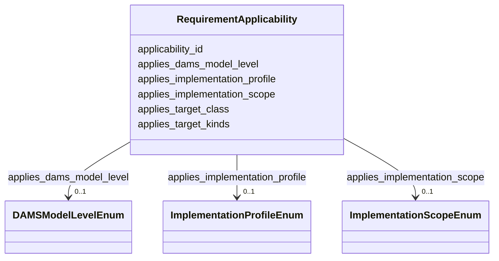

```mermaid
 classDiagram
    class RequirementApplicability
    click RequirementApplicability href "../RequirementApplicability"
      RequirementApplicability : applicability_id
        
      RequirementApplicability : applies_dams_model_level
        
          
    
        
        
        RequirementApplicability --> "0..1" DAMSModelLevelEnum : applies_dams_model_level
        click DAMSModelLevelEnum href "../DAMSModelLevelEnum"
    

        
      RequirementApplicability : applies_implementation_profile
        
          
    
        
        
        RequirementApplicability --> "0..1" ImplementationProfileEnum : applies_implementation_profile
        click ImplementationProfileEnum href "../ImplementationProfileEnum"
    

        
      RequirementApplicability : applies_implementation_scope
        
          
    
        
        
        RequirementApplicability --> "0..1" ImplementationScopeEnum : applies_implementation_scope
        click ImplementationScopeEnum href "../ImplementationScopeEnum"
    

        
      RequirementApplicability : applies_target_class
        
      RequirementApplicability : applies_target_kinds
        
      
```
