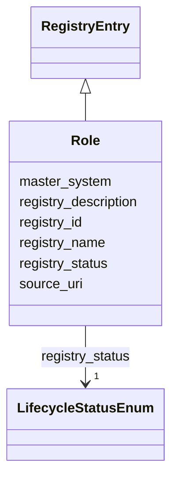

```mermaid
 classDiagram
    class Role
    click Role href "../Role"
      RegistryEntry <|-- Role
        click RegistryEntry href "../RegistryEntry"
      
      Role : master_system
        
      Role : registry_description
        
      Role : registry_id
        
      Role : registry_name
        
      Role : registry_status
        
          
    
        
        
        Role --> "1" LifecycleStatusEnum : registry_status
        click LifecycleStatusEnum href "../LifecycleStatusEnum"
    

        
      Role : source_uri
        
      
```
