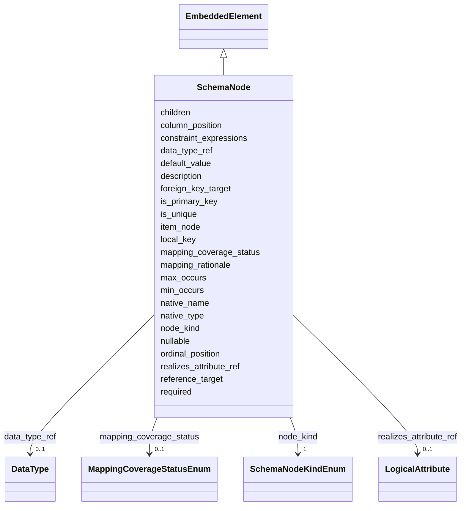

```mermaid
 classDiagram
    class SchemaNode
    click SchemaNode href "../SchemaNode"
      EmbeddedElement <|-- SchemaNode
        click EmbeddedElement href "../EmbeddedElement"
      
      SchemaNode : children
        
      SchemaNode : column_position
        
      SchemaNode : constraint_expressions
        
      SchemaNode : data_type_ref
        
          
    
        
        
        SchemaNode --> "0..1" DataType : data_type_ref
        click DataType href "../DataType"
    

        
      SchemaNode : default_value
        
      SchemaNode : description
        
      SchemaNode : foreign_key_target
        
      SchemaNode : is_primary_key
        
      SchemaNode : is_unique
        
      SchemaNode : item_node
        
      SchemaNode : local_key
        
      SchemaNode : mapping_coverage_status
        
          
    
        
        
        SchemaNode --> "0..1" MappingCoverageStatusEnum : mapping_coverage_status
        click MappingCoverageStatusEnum href "../MappingCoverageStatusEnum"
    

        
      SchemaNode : mapping_rationale
        
      SchemaNode : max_occurs
        
      SchemaNode : min_occurs
        
      SchemaNode : native_name
        
      SchemaNode : native_type
        
      SchemaNode : node_kind
        
          
    
        
        
        SchemaNode --> "1" SchemaNodeKindEnum : node_kind
        click SchemaNodeKindEnum href "../SchemaNodeKindEnum"
    

        
      SchemaNode : nullable
        
      SchemaNode : ordinal_position
        
      SchemaNode : realizes_attribute_ref
        
          
    
        
        
        SchemaNode --> "0..1" LogicalAttribute : realizes_attribute_ref
        click LogicalAttribute href "../LogicalAttribute"
    

        
      SchemaNode : reference_target
        
      SchemaNode : required
        
      
```
