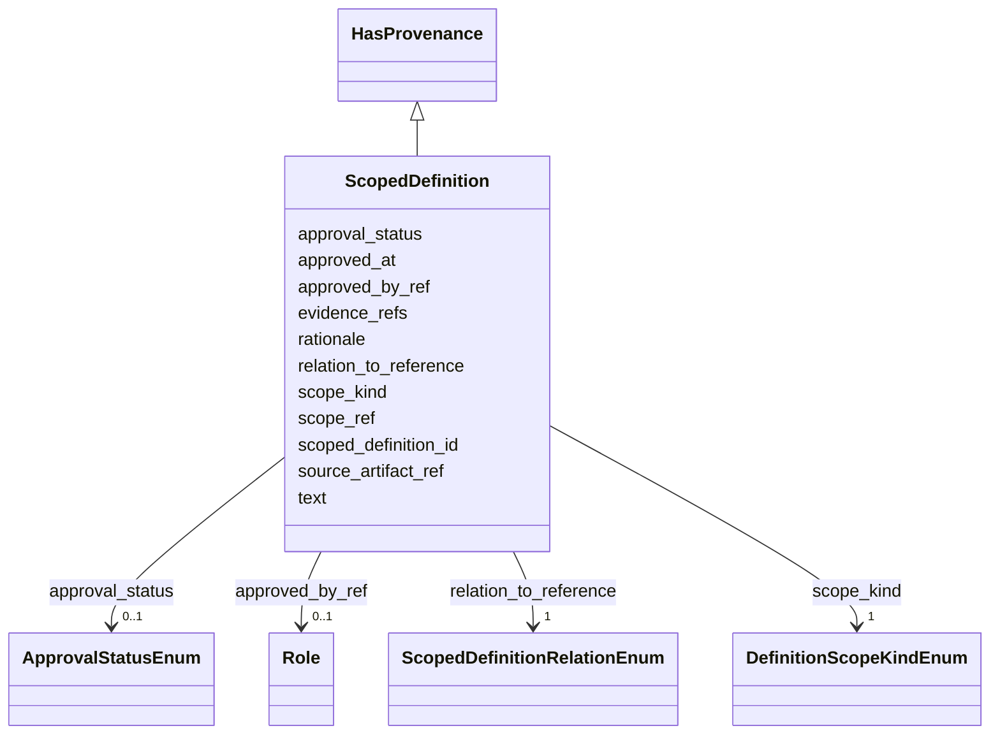

```mermaid
 classDiagram
    class ScopedDefinition
    click ScopedDefinition href "../ScopedDefinition"
      HasProvenance <|-- ScopedDefinition
        click HasProvenance href "../HasProvenance"
      
      ScopedDefinition : approval_status
        
          
    
        
        
        ScopedDefinition --> "0..1" ApprovalStatusEnum : approval_status
        click ApprovalStatusEnum href "../ApprovalStatusEnum"
    

        
      ScopedDefinition : approved_at
        
      ScopedDefinition : approved_by_ref
        
          
    
        
        
        ScopedDefinition --> "0..1" Role : approved_by_ref
        click Role href "../Role"
    

        
      ScopedDefinition : evidence_refs
        
      ScopedDefinition : rationale
        
      ScopedDefinition : relation_to_reference
        
          
    
        
        
        ScopedDefinition --> "1" ScopedDefinitionRelationEnum : relation_to_reference
        click ScopedDefinitionRelationEnum href "../ScopedDefinitionRelationEnum"
    

        
      ScopedDefinition : scope_kind
        
          
    
        
        
        ScopedDefinition --> "1" DefinitionScopeKindEnum : scope_kind
        click DefinitionScopeKindEnum href "../DefinitionScopeKindEnum"
    

        
      ScopedDefinition : scope_ref
        
      ScopedDefinition : scoped_definition_id
        
      ScopedDefinition : source_artifact_ref
        
      ScopedDefinition : text
        
      
```
