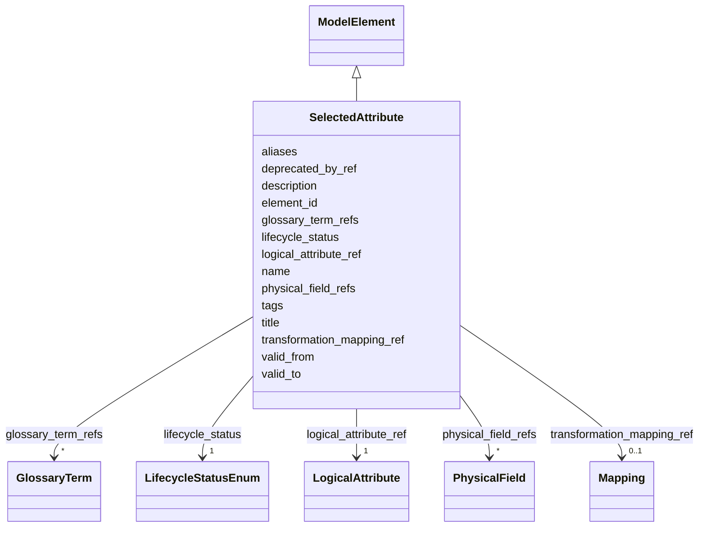

```mermaid
 classDiagram
    class SelectedAttribute
    click SelectedAttribute href "../SelectedAttribute"
      ModelElement <|-- SelectedAttribute
        click ModelElement href "../ModelElement"
      
      SelectedAttribute : aliases
        
      SelectedAttribute : deprecated_by_ref
        
      SelectedAttribute : description
        
      SelectedAttribute : element_id
        
      SelectedAttribute : glossary_term_refs
        
          
    
        
        
        SelectedAttribute --> "*" GlossaryTerm : glossary_term_refs
        click GlossaryTerm href "../GlossaryTerm"
    

        
      SelectedAttribute : lifecycle_status
        
          
    
        
        
        SelectedAttribute --> "1" LifecycleStatusEnum : lifecycle_status
        click LifecycleStatusEnum href "../LifecycleStatusEnum"
    

        
      SelectedAttribute : logical_attribute_ref
        
          
    
        
        
        SelectedAttribute --> "1" LogicalAttribute : logical_attribute_ref
        click LogicalAttribute href "../LogicalAttribute"
    

        
      SelectedAttribute : name
        
      SelectedAttribute : physical_field_refs
        
          
    
        
        
        SelectedAttribute --> "*" PhysicalField : physical_field_refs
        click PhysicalField href "../PhysicalField"
    

        
      SelectedAttribute : tags
        
      SelectedAttribute : title
        
      SelectedAttribute : transformation_mapping_ref
        
          
    
        
        
        SelectedAttribute --> "0..1" Mapping : transformation_mapping_ref
        click Mapping href "../Mapping"
    

        
      SelectedAttribute : valid_from
        
      SelectedAttribute : valid_to
        
      
```
