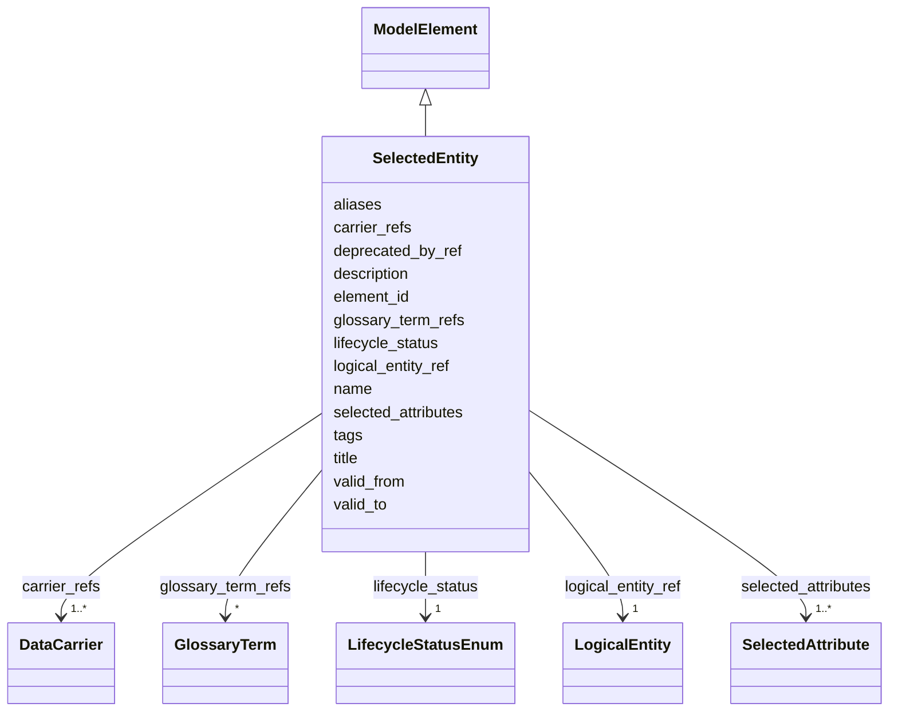

```mermaid
 classDiagram
    class SelectedEntity
    click SelectedEntity href "../SelectedEntity"
      ModelElement <|-- SelectedEntity
        click ModelElement href "../ModelElement"
      
      SelectedEntity : aliases
        
      SelectedEntity : carrier_refs
        
          
    
        
        
        SelectedEntity --> "1..*" DataCarrier : carrier_refs
        click DataCarrier href "../DataCarrier"
    

        
      SelectedEntity : deprecated_by_ref
        
      SelectedEntity : description
        
      SelectedEntity : element_id
        
      SelectedEntity : glossary_term_refs
        
          
    
        
        
        SelectedEntity --> "*" GlossaryTerm : glossary_term_refs
        click GlossaryTerm href "../GlossaryTerm"
    

        
      SelectedEntity : lifecycle_status
        
          
    
        
        
        SelectedEntity --> "1" LifecycleStatusEnum : lifecycle_status
        click LifecycleStatusEnum href "../LifecycleStatusEnum"
    

        
      SelectedEntity : logical_entity_ref
        
          
    
        
        
        SelectedEntity --> "1" LogicalEntity : logical_entity_ref
        click LogicalEntity href "../LogicalEntity"
    

        
      SelectedEntity : name
        
      SelectedEntity : selected_attributes
        
          
    
        
        
        SelectedEntity --> "1..*" SelectedAttribute : selected_attributes
        click SelectedAttribute href "../SelectedAttribute"
    

        
      SelectedEntity : tags
        
      SelectedEntity : title
        
      SelectedEntity : valid_from
        
      SelectedEntity : valid_to
        
      
```
