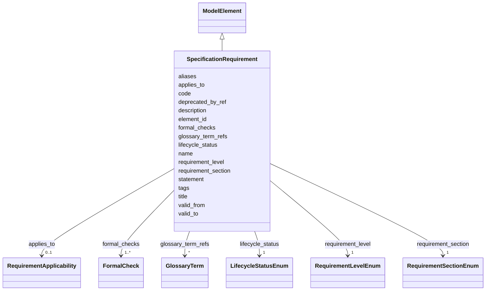

```mermaid
 classDiagram
    class SpecificationRequirement
    click SpecificationRequirement href "../SpecificationRequirement"
      ModelElement <|-- SpecificationRequirement
        click ModelElement href "../ModelElement"
      
      SpecificationRequirement : aliases
        
      SpecificationRequirement : applies_to
        
          
    
        
        
        SpecificationRequirement --> "0..1" RequirementApplicability : applies_to
        click RequirementApplicability href "../RequirementApplicability"
    

        
      SpecificationRequirement : code
        
      SpecificationRequirement : deprecated_by_ref
        
      SpecificationRequirement : description
        
      SpecificationRequirement : element_id
        
      SpecificationRequirement : formal_checks
        
          
    
        
        
        SpecificationRequirement --> "1..*" FormalCheck : formal_checks
        click FormalCheck href "../FormalCheck"
    

        
      SpecificationRequirement : glossary_term_refs
        
          
    
        
        
        SpecificationRequirement --> "*" GlossaryTerm : glossary_term_refs
        click GlossaryTerm href "../GlossaryTerm"
    

        
      SpecificationRequirement : lifecycle_status
        
          
    
        
        
        SpecificationRequirement --> "1" LifecycleStatusEnum : lifecycle_status
        click LifecycleStatusEnum href "../LifecycleStatusEnum"
    

        
      SpecificationRequirement : name
        
      SpecificationRequirement : requirement_level
        
          
    
        
        
        SpecificationRequirement --> "1" RequirementLevelEnum : requirement_level
        click RequirementLevelEnum href "../RequirementLevelEnum"
    

        
      SpecificationRequirement : requirement_section
        
          
    
        
        
        SpecificationRequirement --> "1" RequirementSectionEnum : requirement_section
        click RequirementSectionEnum href "../RequirementSectionEnum"
    

        
      SpecificationRequirement : statement
        
      SpecificationRequirement : tags
        
      SpecificationRequirement : title
        
      SpecificationRequirement : valid_from
        
      SpecificationRequirement : valid_to
        
      
```
