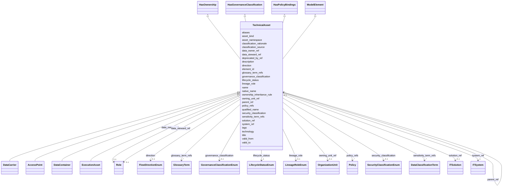

```mermaid
 classDiagram
    class TechnicalAsset
    click TechnicalAsset href "../TechnicalAsset"
      HasOwnership <|-- TechnicalAsset
        click HasOwnership href "../HasOwnership"
      HasGovernanceClassification <|-- TechnicalAsset
        click HasGovernanceClassification href "../HasGovernanceClassification"
      HasPolicyBindings <|-- TechnicalAsset
        click HasPolicyBindings href "../HasPolicyBindings"
      ModelElement <|-- TechnicalAsset
        click ModelElement href "../ModelElement"
      

      TechnicalAsset <|-- DataCarrier
        click DataCarrier href "../DataCarrier"
      TechnicalAsset <|-- AccessPoint
        click AccessPoint href "../AccessPoint"
      TechnicalAsset <|-- DataContainer
        click DataContainer href "../DataContainer"
      TechnicalAsset <|-- ExecutionAsset
        click ExecutionAsset href "../ExecutionAsset"
      

      TechnicalAsset : aliases
        
      TechnicalAsset : asset_kind
        
      TechnicalAsset : asset_namespace
        
      TechnicalAsset : classification_rationale
        
      TechnicalAsset : classification_source
        
      TechnicalAsset : data_owner_ref
        
          
    
        
        
        TechnicalAsset --> "0..1" Role : data_owner_ref
        click Role href "../Role"
    

        
      TechnicalAsset : data_steward_ref
        
          
    
        
        
        TechnicalAsset --> "0..1" Role : data_steward_ref
        click Role href "../Role"
    

        
      TechnicalAsset : deprecated_by_ref
        
      TechnicalAsset : description
        
      TechnicalAsset : direction
        
          
    
        
        
        TechnicalAsset --> "0..1" FlowDirectionEnum : direction
        click FlowDirectionEnum href "../FlowDirectionEnum"
    

        
      TechnicalAsset : element_id
        
      TechnicalAsset : glossary_term_refs
        
          
    
        
        
        TechnicalAsset --> "*" GlossaryTerm : glossary_term_refs
        click GlossaryTerm href "../GlossaryTerm"
    

        
      TechnicalAsset : governance_classification
        
          
    
        
        
        TechnicalAsset --> "0..1" GovernanceClassificationEnum : governance_classification
        click GovernanceClassificationEnum href "../GovernanceClassificationEnum"
    

        
      TechnicalAsset : lifecycle_status
        
          
    
        
        
        TechnicalAsset --> "1" LifecycleStatusEnum : lifecycle_status
        click LifecycleStatusEnum href "../LifecycleStatusEnum"
    

        
      TechnicalAsset : lineage_role
        
          
    
        
        
        TechnicalAsset --> "0..1" LineageRoleEnum : lineage_role
        click LineageRoleEnum href "../LineageRoleEnum"
    

        
      TechnicalAsset : name
        
      TechnicalAsset : native_name
        
      TechnicalAsset : ownership_inheritance_rule
        
      TechnicalAsset : owning_unit_ref
        
          
    
        
        
        TechnicalAsset --> "0..1" OrganizationUnit : owning_unit_ref
        click OrganizationUnit href "../OrganizationUnit"
    

        
      TechnicalAsset : parent_ref
        
          
    
        
        
        TechnicalAsset --> "0..1" TechnicalAsset : parent_ref
        click TechnicalAsset href "../TechnicalAsset"
    

        
      TechnicalAsset : policy_refs
        
          
    
        
        
        TechnicalAsset --> "*" Policy : policy_refs
        click Policy href "../Policy"
    

        
      TechnicalAsset : qualified_name
        
      TechnicalAsset : security_classification
        
          
    
        
        
        TechnicalAsset --> "0..1" SecurityClassificationEnum : security_classification
        click SecurityClassificationEnum href "../SecurityClassificationEnum"
    

        
      TechnicalAsset : sensitivity_term_refs
        
          
    
        
        
        TechnicalAsset --> "*" DataClassificationTerm : sensitivity_term_refs
        click DataClassificationTerm href "../DataClassificationTerm"
    

        
      TechnicalAsset : solution_ref
        
          
    
        
        
        TechnicalAsset --> "0..1" ITSolution : solution_ref
        click ITSolution href "../ITSolution"
    

        
      TechnicalAsset : system_ref
        
          
    
        
        
        TechnicalAsset --> "1" ITSystem : system_ref
        click ITSystem href "../ITSystem"
    

        
      TechnicalAsset : tags
        
      TechnicalAsset : technology
        
      TechnicalAsset : title
        
      TechnicalAsset : valid_from
        
      TechnicalAsset : valid_to
        
      
```
