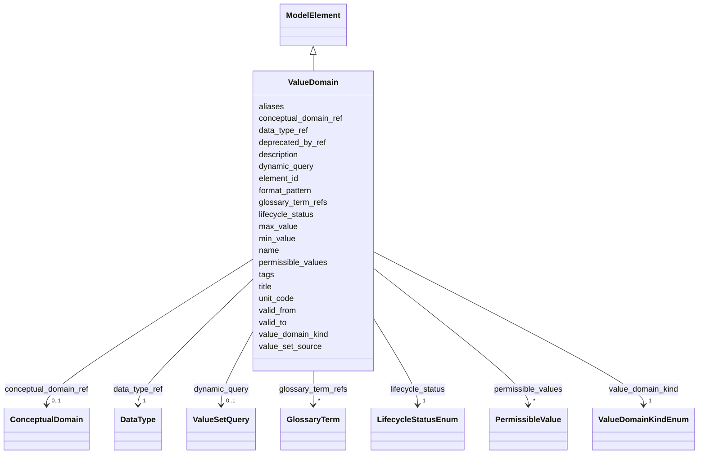

```mermaid
 classDiagram
    class ValueDomain
    click ValueDomain href "../ValueDomain"
      ModelElement <|-- ValueDomain
        click ModelElement href "../ModelElement"
      
      ValueDomain : aliases
        
      ValueDomain : conceptual_domain_ref
        
          
    
        
        
        ValueDomain --> "0..1" ConceptualDomain : conceptual_domain_ref
        click ConceptualDomain href "../ConceptualDomain"
    

        
      ValueDomain : data_type_ref
        
          
    
        
        
        ValueDomain --> "1" DataType : data_type_ref
        click DataType href "../DataType"
    

        
      ValueDomain : deprecated_by_ref
        
      ValueDomain : description
        
      ValueDomain : dynamic_query
        
          
    
        
        
        ValueDomain --> "0..1" ValueSetQuery : dynamic_query
        click ValueSetQuery href "../ValueSetQuery"
    

        
      ValueDomain : element_id
        
      ValueDomain : format_pattern
        
      ValueDomain : glossary_term_refs
        
          
    
        
        
        ValueDomain --> "*" GlossaryTerm : glossary_term_refs
        click GlossaryTerm href "../GlossaryTerm"
    

        
      ValueDomain : lifecycle_status
        
          
    
        
        
        ValueDomain --> "1" LifecycleStatusEnum : lifecycle_status
        click LifecycleStatusEnum href "../LifecycleStatusEnum"
    

        
      ValueDomain : max_value
        
      ValueDomain : min_value
        
      ValueDomain : name
        
      ValueDomain : permissible_values
        
          
    
        
        
        ValueDomain --> "*" PermissibleValue : permissible_values
        click PermissibleValue href "../PermissibleValue"
    

        
      ValueDomain : tags
        
      ValueDomain : title
        
      ValueDomain : unit_code
        
      ValueDomain : valid_from
        
      ValueDomain : valid_to
        
      ValueDomain : value_domain_kind
        
          
    
        
        
        ValueDomain --> "1" ValueDomainKindEnum : value_domain_kind
        click ValueDomainKindEnum href "../ValueDomainKindEnum"
    

        
      ValueDomain : value_set_source
        
      
```
