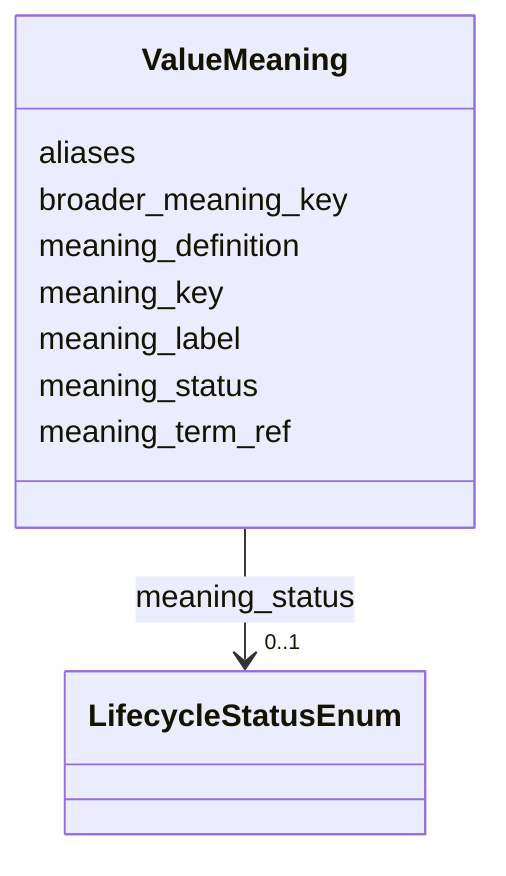

```mermaid
 classDiagram
    class ValueMeaning
    click ValueMeaning href "../ValueMeaning"
      ValueMeaning : aliases
        
      ValueMeaning : broader_meaning_key
        
      ValueMeaning : meaning_definition
        
      ValueMeaning : meaning_key
        
      ValueMeaning : meaning_label
        
      ValueMeaning : meaning_status
        
          
    
        
        
        ValueMeaning --> "0..1" LifecycleStatusEnum : meaning_status
        click LifecycleStatusEnum href "../LifecycleStatusEnum"
    

        
      ValueMeaning : meaning_term_ref
        
      
```
