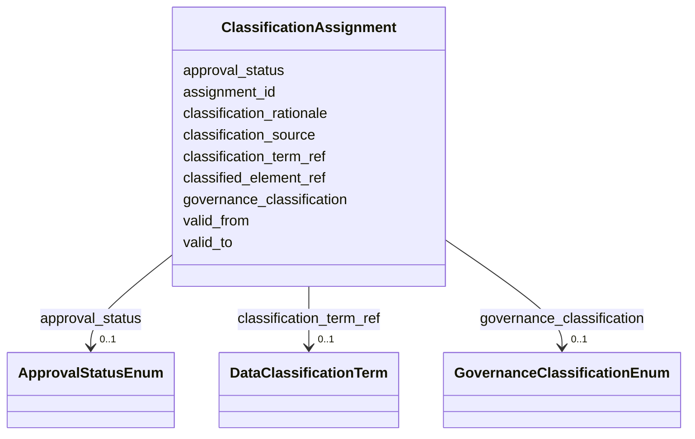

---
search:
  boost: 10.0
---

# Class: ClassificationAssignment 


_Версионируемое назначение категории классификации элементу модели с основанием и периодом действия._


<div data-search-exclude markdown="1">


URI: [dams:ClassificationAssignment](https://data.moex.com/dams/ClassificationAssignment)





<!-- no inheritance hierarchy -->

## Slots

| Name | Cardinality and Range | Description | Inheritance |
| ---  | --- | --- | --- |
| [assignment_id](assignment_id.md) | 1 <br/> [Uriorcurie](Uriorcurie.md) |  | direct |
| [classified_element_ref](classified_element_ref.md) | 1 <br/> [Uriorcurie](Uriorcurie.md) |  | direct |
| [classification_term_ref](classification_term_ref.md) | 0..1 <br/> [DataClassificationTerm](DataClassificationTerm.md) |  | direct |
| [governance_classification](governance_classification.md) | 0..1 <br/> [GovernanceClassificationEnum](GovernanceClassificationEnum.md) |  | direct |
| [classification_source](classification_source.md) | 0..1 <br/> [String](String.md) |  | direct |
| [classification_rationale](classification_rationale.md) | 0..1 <br/> [String](String.md) |  | direct |
| [valid_from](valid_from.md) | 0..1 <br/> [Datetime](Datetime.md) |  | direct |
| [valid_to](valid_to.md) | 0..1 <br/> [Datetime](Datetime.md) |  | direct |
| [approval_status](approval_status.md) | 0..1 <br/> [ApprovalStatusEnum](ApprovalStatusEnum.md) |  | direct |


## Usages

| used by | used in | type | used |
| ---  | --- | --- | --- |
| [MOEXModelRepository](MOEXModelRepository.md) | [classification_assignments](classification_assignments.md) | range | [ClassificationAssignment](ClassificationAssignment.md) |


## Identifier and Mapping Information


### Schema Source


* from schema: https://data.moex.com/dams/v0.1


## Mappings

| Mapping Type | Mapped Value |
| ---  | ---  |
| self | dams:ClassificationAssignment |
| native | dams:ClassificationAssignment |


## LinkML Source

<!-- TODO: investigate https://stackoverflow.com/questions/37606292/how-to-create-tabbed-code-blocks-in-mkdocs-or-sphinx -->

### Direct

<details>
```yaml
name: ClassificationAssignment
description: Версионируемое назначение категории классификации элементу модели с основанием
  и периодом действия.
from_schema: https://data.moex.com/dams/v0.1
rank: 1000
slots:
- assignment_id
- classified_element_ref
- classification_term_ref
- governance_classification
- classification_source
- classification_rationale
- valid_from
- valid_to
- approval_status

```
</details>

### Induced

<details>
```yaml
name: ClassificationAssignment
description: Версионируемое назначение категории классификации элементу модели с основанием
  и периодом действия.
from_schema: https://data.moex.com/dams/v0.1
rank: 1000
attributes:
  assignment_id:
    name: assignment_id
    from_schema: https://data.moex.com/dams/v0.1
    rank: 1000
    identifier: true
    owner: ClassificationAssignment
    domain_of:
    - ClassificationAssignment
    range: uriorcurie
    required: true
  classified_element_ref:
    name: classified_element_ref
    from_schema: https://data.moex.com/dams/v0.1
    rank: 1000
    owner: ClassificationAssignment
    domain_of:
    - ClassificationAssignment
    range: uriorcurie
    required: true
  classification_term_ref:
    name: classification_term_ref
    from_schema: https://data.moex.com/dams/v0.1
    rank: 1000
    owner: ClassificationAssignment
    domain_of:
    - ClassificationAssignment
    range: DataClassificationTerm
    inlined: false
  governance_classification:
    name: governance_classification
    from_schema: https://data.moex.com/dams/v0.1
    rank: 1000
    owner: ClassificationAssignment
    domain_of:
    - ClassificationAssignment
    - HasGovernanceClassification
    range: GovernanceClassificationEnum
  classification_source:
    name: classification_source
    from_schema: https://data.moex.com/dams/v0.1
    rank: 1000
    owner: ClassificationAssignment
    domain_of:
    - ClassificationAssignment
    - HasGovernanceClassification
    range: string
  classification_rationale:
    name: classification_rationale
    from_schema: https://data.moex.com/dams/v0.1
    rank: 1000
    owner: ClassificationAssignment
    domain_of:
    - ClassificationAssignment
    - HasGovernanceClassification
    range: string
  valid_from:
    name: valid_from
    from_schema: https://data.moex.com/dams/v0.1
    rank: 1000
    owner: ClassificationAssignment
    domain_of:
    - ClassificationAssignment
    - PolicyBinding
    - HasLifecycle
    - Mapping
    range: datetime
  valid_to:
    name: valid_to
    from_schema: https://data.moex.com/dams/v0.1
    rank: 1000
    owner: ClassificationAssignment
    domain_of:
    - ClassificationAssignment
    - PolicyBinding
    - HasLifecycle
    - Mapping
    range: datetime
  approval_status:
    name: approval_status
    from_schema: https://data.moex.com/dams/v0.1
    rank: 1000
    owner: ClassificationAssignment
    domain_of:
    - ClassificationAssignment
    - PolicyBinding
    - HasProvenance
    range: ApprovalStatusEnum

```
</details></div>
