---
search:
  boost: 10.0
---

# Class: DataFlow 


_Ссылочная проекция зарегистрированной интеграции; топология и канал являются данными Clinkr, а семантика — модели данных._


<div data-search-exclude markdown="1">


URI: [dams:DataFlow](https://data.moex.com/dams/DataFlow)

```mermaid
 classDiagram
    class DataFlow
    click DataFlow href "../DataFlow/"
      HasOwnership <|-- DataFlow
        click HasOwnership href "../HasOwnership/"
      HasLifecycle <|-- DataFlow
        click HasLifecycle href "../HasLifecycle/"
      ModelElement <|-- DataFlow
        click ModelElement href "../ModelElement/"
      
      DataFlow : aliases
        
      DataFlow : contract_ref
        
          
    
        
        
        DataFlow --> "0..1" DataContractReference : contract_ref
        click DataContractReference href "../DataContractReference/"
    

        
      DataFlow : data_owner_ref
        
          
    
        
        
        DataFlow --> "0..1" Role : data_owner_ref
        click Role href "../Role/"
    

        
      DataFlow : data_steward_ref
        
          
    
        
        
        DataFlow --> "0..1" Role : data_steward_ref
        click Role href "../Role/"
    

        
      DataFlow : deprecated_by_ref
        
      DataFlow : description
        
      DataFlow : element_id
        
      DataFlow : entity_bindings
        
          
    
        
        
        DataFlow --> "*" DataFlowEntityBinding : entity_bindings
        click DataFlowEntityBinding href "../DataFlowEntityBinding/"
    

        
      DataFlow : glossary_term_refs
        
          
    
        
        
        DataFlow --> "*" GlossaryTerm : glossary_term_refs
        click GlossaryTerm href "../GlossaryTerm/"
    

        
      DataFlow : integration_channel
        
          
    
        
        
        DataFlow --> "1" IntegrationChannelEnum : integration_channel
        click IntegrationChannelEnum href "../IntegrationChannelEnum/"
    

        
      DataFlow : integration_class
        
          
    
        
        
        DataFlow --> "1" IntegrationClassEnum : integration_class
        click IntegrationClassEnum href "../IntegrationClassEnum/"
    

        
      DataFlow : integration_level
        
          
    
        
        
        DataFlow --> "1" IntegrationLevelEnum : integration_level
        click IntegrationLevelEnum href "../IntegrationLevelEnum/"
    

        
      DataFlow : integration_ref
        
          
    
        
        
        DataFlow --> "1" IntegrationReference : integration_ref
        click IntegrationReference href "../IntegrationReference/"
    

        
      DataFlow : integration_spec_ref
        
      DataFlow : lifecycle_status
        
          
    
        
        
        DataFlow --> "1" LifecycleStatusEnum : lifecycle_status
        click LifecycleStatusEnum href "../LifecycleStatusEnum/"
    

        
      DataFlow : name
        
      DataFlow : owning_unit_ref
        
          
    
        
        
        DataFlow --> "0..1" OrganizationUnit : owning_unit_ref
        click OrganizationUnit href "../OrganizationUnit/"
    

        
      DataFlow : source_platform_ref
        
          
    
        
        
        DataFlow --> "1" ITPlatform : source_platform_ref
        click ITPlatform href "../ITPlatform/"
    

        
      DataFlow : source_solution_ref
        
          
    
        
        
        DataFlow --> "1" ITSolution : source_solution_ref
        click ITSolution href "../ITSolution/"
    

        
      DataFlow : source_system_ref
        
          
    
        
        
        DataFlow --> "1" ITSystem : source_system_ref
        click ITSystem href "../ITSystem/"
    

        
      DataFlow : tags
        
      DataFlow : target_platform_ref
        
          
    
        
        
        DataFlow --> "1" ITPlatform : target_platform_ref
        click ITPlatform href "../ITPlatform/"
    

        
      DataFlow : target_solution_ref
        
          
    
        
        
        DataFlow --> "1" ITSolution : target_solution_ref
        click ITSolution href "../ITSolution/"
    

        
      DataFlow : target_system_ref
        
          
    
        
        
        DataFlow --> "1" ITSystem : target_system_ref
        click ITSystem href "../ITSystem/"
    

        
      DataFlow : title
        
      DataFlow : valid_from
        
      DataFlow : valid_to
        
      
```





## Inheritance
* [ModelElement](ModelElement.md) [ [HasLifecycle](HasLifecycle.md)]
    * **DataFlow** [ [HasOwnership](HasOwnership.md) [HasLifecycle](HasLifecycle.md)]


## Slots

| Name | Cardinality and Range | Description | Inheritance |
| ---  | --- | --- | --- |
| [integration_ref](integration_ref.md) | 1 <br/> [IntegrationReference](IntegrationReference.md) |  | direct |
| [contract_ref](contract_ref.md) | 0..1 <br/> [DataContractReference](DataContractReference.md) |  | direct |
| [source_solution_ref](source_solution_ref.md) | 1 <br/> [ITSolution](ITSolution.md) |  | direct |
| [target_solution_ref](target_solution_ref.md) | 1 <br/> [ITSolution](ITSolution.md) |  | direct |
| [source_system_ref](source_system_ref.md) | 1 <br/> [ITSystem](ITSystem.md) |  | direct |
| [target_system_ref](target_system_ref.md) | 1 <br/> [ITSystem](ITSystem.md) |  | direct |
| [source_platform_ref](source_platform_ref.md) | 1 <br/> [ITPlatform](ITPlatform.md) |  | direct |
| [target_platform_ref](target_platform_ref.md) | 1 <br/> [ITPlatform](ITPlatform.md) |  | direct |
| [integration_level](integration_level.md) | 1 <br/> [IntegrationLevelEnum](IntegrationLevelEnum.md) |  | direct |
| [integration_class](integration_class.md) | 1 <br/> [IntegrationClassEnum](IntegrationClassEnum.md) |  | direct |
| [integration_channel](integration_channel.md) | 1 <br/> [IntegrationChannelEnum](IntegrationChannelEnum.md) |  | direct |
| [integration_spec_ref](integration_spec_ref.md) | 1 <br/> [Uri](Uri.md) |  | direct |
| [entity_bindings](entity_bindings.md) | * <br/> [DataFlowEntityBinding](DataFlowEntityBinding.md) |  | direct |
| [data_owner_ref](data_owner_ref.md) | 0..1 <br/> [Role](Role.md) |  | [HasOwnership](HasOwnership.md) |
| [data_steward_ref](data_steward_ref.md) | 0..1 <br/> [Role](Role.md) |  | [HasOwnership](HasOwnership.md) |
| [owning_unit_ref](owning_unit_ref.md) | 0..1 <br/> [OrganizationUnit](OrganizationUnit.md) |  | [HasOwnership](HasOwnership.md) |
| [lifecycle_status](lifecycle_status.md) | 1 <br/> [LifecycleStatusEnum](LifecycleStatusEnum.md) |  | [HasLifecycle](HasLifecycle.md) |
| [valid_from](valid_from.md) | 0..1 <br/> [Datetime](Datetime.md) |  | [HasLifecycle](HasLifecycle.md) |
| [valid_to](valid_to.md) | 0..1 <br/> [Datetime](Datetime.md) |  | [HasLifecycle](HasLifecycle.md) |
| [deprecated_by_ref](deprecated_by_ref.md) | 0..1 <br/> [Uriorcurie](Uriorcurie.md) |  | [HasLifecycle](HasLifecycle.md) |
| [element_id](element_id.md) | 1 <br/> [Uriorcurie](Uriorcurie.md) |  | [ModelElement](ModelElement.md) |
| [name](name.md) | 1 <br/> [String](String.md) |  | [ModelElement](ModelElement.md) |
| [title](title.md) | 0..1 <br/> [String](String.md) |  | [ModelElement](ModelElement.md) |
| [description](description.md) | 1 <br/> [String](String.md) |  | [ModelElement](ModelElement.md) |
| [aliases](aliases.md) | * <br/> [String](String.md) |  | [ModelElement](ModelElement.md) |
| [glossary_term_refs](glossary_term_refs.md) | * <br/> [GlossaryTerm](GlossaryTerm.md) |  | [ModelElement](ModelElement.md) |
| [tags](tags.md) | * <br/> [String](String.md) |  | [ModelElement](ModelElement.md) |


## Usages

| used by | used in | type | used |
| ---  | --- | --- | --- |
| [MOEXModelRepository](MOEXModelRepository.md) | [data_flows](data_flows.md) | range | [DataFlow](DataFlow.md) |
| [DataFlowEntityBinding](DataFlowEntityBinding.md) | [flow_ref](flow_ref.md) | range | [DataFlow](DataFlow.md) |


## Identifier and Mapping Information


### Schema Source


* from schema: https://data.moex.com/dams/v0.1


## Mappings

| Mapping Type | Mapped Value |
| ---  | ---  |
| self | dams:DataFlow |
| native | dams:DataFlow |


## LinkML Source

<!-- TODO: investigate https://stackoverflow.com/questions/37606292/how-to-create-tabbed-code-blocks-in-mkdocs-or-sphinx -->

### Direct

<details>
```yaml
name: DataFlow
description: Ссылочная проекция зарегистрированной интеграции; топология и канал являются
  данными Clinkr, а семантика — модели данных.
from_schema: https://data.moex.com/dams/v0.1
rank: 1000
is_a: ModelElement
mixins:
- HasOwnership
- HasLifecycle
slots:
- integration_ref
- contract_ref
- source_solution_ref
- target_solution_ref
- source_system_ref
- target_system_ref
- source_platform_ref
- target_platform_ref
- integration_level
- integration_class
- integration_channel
- integration_spec_ref
- entity_bindings

```
</details>

### Induced

<details>
```yaml
name: DataFlow
description: Ссылочная проекция зарегистрированной интеграции; топология и канал являются
  данными Clinkr, а семантика — модели данных.
from_schema: https://data.moex.com/dams/v0.1
rank: 1000
is_a: ModelElement
mixins:
- HasOwnership
- HasLifecycle
attributes:
  integration_ref:
    name: integration_ref
    from_schema: https://data.moex.com/dams/v0.1
    rank: 1000
    owner: DataFlow
    domain_of:
    - DataFlow
    - DataModelBinding
    range: IntegrationReference
    required: true
    inlined: false
  contract_ref:
    name: contract_ref
    from_schema: https://data.moex.com/dams/v0.1
    rank: 1000
    owner: DataFlow
    domain_of:
    - DataFlow
    - DataModelBinding
    range: DataContractReference
    inlined: false
  source_solution_ref:
    name: source_solution_ref
    from_schema: https://data.moex.com/dams/v0.1
    rank: 1000
    owner: DataFlow
    domain_of:
    - DataFlow
    range: ITSolution
    required: true
    inlined: false
  target_solution_ref:
    name: target_solution_ref
    from_schema: https://data.moex.com/dams/v0.1
    rank: 1000
    owner: DataFlow
    domain_of:
    - DataFlow
    range: ITSolution
    required: true
    inlined: false
  source_system_ref:
    name: source_system_ref
    from_schema: https://data.moex.com/dams/v0.1
    rank: 1000
    owner: DataFlow
    domain_of:
    - DataFlow
    range: ITSystem
    required: true
    inlined: false
  target_system_ref:
    name: target_system_ref
    from_schema: https://data.moex.com/dams/v0.1
    rank: 1000
    owner: DataFlow
    domain_of:
    - DataFlow
    range: ITSystem
    required: true
    inlined: false
  source_platform_ref:
    name: source_platform_ref
    from_schema: https://data.moex.com/dams/v0.1
    rank: 1000
    owner: DataFlow
    domain_of:
    - DataFlow
    range: ITPlatform
    required: true
    inlined: false
  target_platform_ref:
    name: target_platform_ref
    from_schema: https://data.moex.com/dams/v0.1
    rank: 1000
    owner: DataFlow
    domain_of:
    - DataFlow
    range: ITPlatform
    required: true
    inlined: false
  integration_level:
    name: integration_level
    from_schema: https://data.moex.com/dams/v0.1
    rank: 1000
    owner: DataFlow
    domain_of:
    - DataFlow
    range: IntegrationLevelEnum
    required: true
  integration_class:
    name: integration_class
    from_schema: https://data.moex.com/dams/v0.1
    rank: 1000
    owner: DataFlow
    domain_of:
    - DataFlow
    range: IntegrationClassEnum
    required: true
  integration_channel:
    name: integration_channel
    from_schema: https://data.moex.com/dams/v0.1
    rank: 1000
    owner: DataFlow
    domain_of:
    - DataFlow
    range: IntegrationChannelEnum
    required: true
  integration_spec_ref:
    name: integration_spec_ref
    from_schema: https://data.moex.com/dams/v0.1
    rank: 1000
    owner: DataFlow
    domain_of:
    - DataFlow
    range: uri
    required: true
  entity_bindings:
    name: entity_bindings
    from_schema: https://data.moex.com/dams/v0.1
    rank: 1000
    owner: DataFlow
    domain_of:
    - DataFlow
    range: DataFlowEntityBinding
    multivalued: true
    inlined: true
    inlined_as_list: true
  data_owner_ref:
    name: data_owner_ref
    from_schema: https://data.moex.com/dams/v0.1
    rank: 1000
    owner: DataFlow
    domain_of:
    - HasOwnership
    range: Role
    inlined: false
  data_steward_ref:
    name: data_steward_ref
    from_schema: https://data.moex.com/dams/v0.1
    rank: 1000
    owner: DataFlow
    domain_of:
    - HasOwnership
    range: Role
    inlined: false
  owning_unit_ref:
    name: owning_unit_ref
    from_schema: https://data.moex.com/dams/v0.1
    rank: 1000
    owner: DataFlow
    domain_of:
    - HasOwnership
    range: OrganizationUnit
    inlined: false
  lifecycle_status:
    name: lifecycle_status
    from_schema: https://data.moex.com/dams/v0.1
    rank: 1000
    owner: DataFlow
    domain_of:
    - HasLifecycle
    range: LifecycleStatusEnum
    required: true
  valid_from:
    name: valid_from
    from_schema: https://data.moex.com/dams/v0.1
    rank: 1000
    owner: DataFlow
    domain_of:
    - ClassificationAssignment
    - PolicyBinding
    - HasLifecycle
    - Mapping
    range: datetime
  valid_to:
    name: valid_to
    from_schema: https://data.moex.com/dams/v0.1
    rank: 1000
    owner: DataFlow
    domain_of:
    - ClassificationAssignment
    - PolicyBinding
    - HasLifecycle
    - Mapping
    range: datetime
  deprecated_by_ref:
    name: deprecated_by_ref
    from_schema: https://data.moex.com/dams/v0.1
    rank: 1000
    owner: DataFlow
    domain_of:
    - HasLifecycle
    range: uriorcurie
  element_id:
    name: element_id
    from_schema: https://data.moex.com/dams/v0.1
    rank: 1000
    identifier: true
    owner: DataFlow
    domain_of:
    - ModelElement
    range: uriorcurie
    required: true
  name:
    name: name
    from_schema: https://data.moex.com/dams/v0.1
    rank: 1000
    owner: DataFlow
    domain_of:
    - ModelElement
    - RequirementCatalog
    range: string
    required: true
  title:
    name: title
    from_schema: https://data.moex.com/dams/v0.1
    rank: 1000
    owner: DataFlow
    domain_of:
    - ModelElement
    range: string
  description:
    name: description
    from_schema: https://data.moex.com/dams/v0.1
    rank: 1000
    owner: DataFlow
    domain_of:
    - ModelElement
    range: string
    required: true
  aliases:
    name: aliases
    from_schema: https://data.moex.com/dams/v0.1
    rank: 1000
    owner: DataFlow
    domain_of:
    - ModelElement
    range: string
    multivalued: true
  glossary_term_refs:
    name: glossary_term_refs
    from_schema: https://data.moex.com/dams/v0.1
    rank: 1000
    owner: DataFlow
    domain_of:
    - ModelElement
    range: GlossaryTerm
    multivalued: true
    inlined: false
  tags:
    name: tags
    from_schema: https://data.moex.com/dams/v0.1
    rank: 1000
    owner: DataFlow
    domain_of:
    - ModelElement
    range: string
    multivalued: true

```
</details></div>
