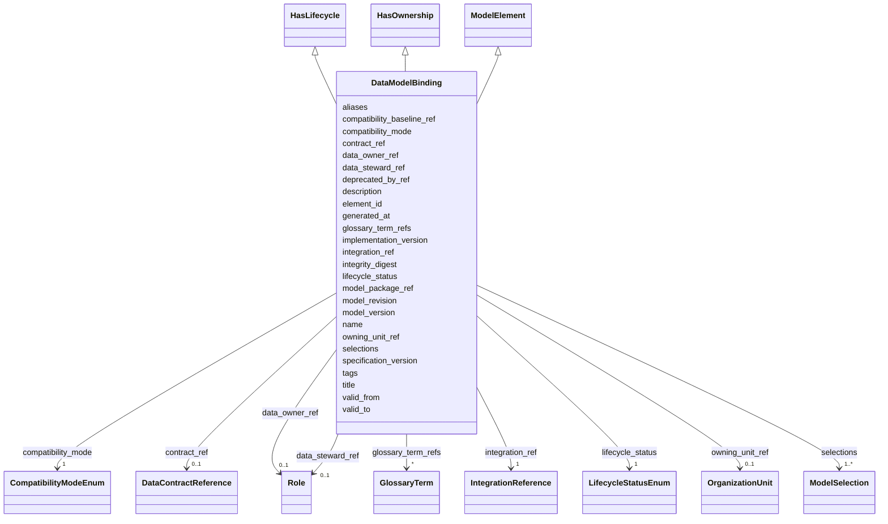

---
search:
  boost: 10.0
---

# Class: DataModelBinding 


_Дочерняя модельная спецификация дата-контракта, фиксирующая неизменяемую ревизию модели и передаваемый срез._


<div data-search-exclude markdown="1">


URI: [dams:DataModelBinding](https://data.moex.com/dams/DataModelBinding)





## Inheritance
* [ModelElement](ModelElement.md) [ [HasLifecycle](HasLifecycle.md)]
    * **DataModelBinding** [ [HasLifecycle](HasLifecycle.md) [HasOwnership](HasOwnership.md)]


## Slots

| Name | Cardinality and Range | Description | Inheritance |
| ---  | --- | --- | --- |
| [specification_version](specification_version.md) | 1 <br/> [SemVer](SemVer.md) |  | direct |
| [implementation_version](implementation_version.md) | 1 <br/> [SemVer](SemVer.md) |  | direct |
| [contract_ref](contract_ref.md) | 0..1 <br/> [DataContractReference](DataContractReference.md) |  | direct |
| [integration_ref](integration_ref.md) | 1 <br/> [IntegrationReference](IntegrationReference.md) |  | direct |
| [model_package_ref](model_package_ref.md) | 1 <br/> [Uri](Uri.md) |  | direct |
| [model_version](model_version.md) | 1 <br/> [SemVer](SemVer.md) |  | direct |
| [model_revision](model_revision.md) | 1 <br/> [String](String.md) |  | direct |
| [selections](selections.md) | 1..* <br/> [ModelSelection](ModelSelection.md) |  | direct |
| [compatibility_mode](compatibility_mode.md) | 1 <br/> [CompatibilityModeEnum](CompatibilityModeEnum.md) |  | direct |
| [compatibility_baseline_ref](compatibility_baseline_ref.md) | 0..1 <br/> [Uri](Uri.md) |  | direct |
| [integrity_digest](integrity_digest.md) | 1 <br/> [Sha256Digest](Sha256Digest.md) |  | direct |
| [generated_at](generated_at.md) | 1 <br/> [Datetime](Datetime.md) |  | direct |
| [lifecycle_status](lifecycle_status.md) | 1 <br/> [LifecycleStatusEnum](LifecycleStatusEnum.md) |  | [HasLifecycle](HasLifecycle.md) |
| [valid_from](valid_from.md) | 0..1 <br/> [Datetime](Datetime.md) |  | [HasLifecycle](HasLifecycle.md) |
| [valid_to](valid_to.md) | 0..1 <br/> [Datetime](Datetime.md) |  | [HasLifecycle](HasLifecycle.md) |
| [deprecated_by_ref](deprecated_by_ref.md) | 0..1 <br/> [Uriorcurie](Uriorcurie.md) |  | [HasLifecycle](HasLifecycle.md) |
| [data_owner_ref](data_owner_ref.md) | 0..1 <br/> [Role](Role.md) |  | [HasOwnership](HasOwnership.md) |
| [data_steward_ref](data_steward_ref.md) | 0..1 <br/> [Role](Role.md) |  | [HasOwnership](HasOwnership.md) |
| [owning_unit_ref](owning_unit_ref.md) | 0..1 <br/> [OrganizationUnit](OrganizationUnit.md) |  | [HasOwnership](HasOwnership.md) |
| [element_id](element_id.md) | 1 <br/> [Uriorcurie](Uriorcurie.md) |  | [ModelElement](ModelElement.md) |
| [name](name.md) | 1 <br/> [String](String.md) |  | [ModelElement](ModelElement.md) |
| [title](title.md) | 0..1 <br/> [String](String.md) |  | [ModelElement](ModelElement.md) |
| [description](description.md) | 1 <br/> [String](String.md) |  | [ModelElement](ModelElement.md) |
| [aliases](aliases.md) | * <br/> [String](String.md) |  | [ModelElement](ModelElement.md) |
| [glossary_term_refs](glossary_term_refs.md) | * <br/> [GlossaryTerm](GlossaryTerm.md) |  | [ModelElement](ModelElement.md) |
| [tags](tags.md) | * <br/> [String](String.md) |  | [ModelElement](ModelElement.md) |


## Usages

| used by | used in | type | used |
| ---  | --- | --- | --- |
| [MOEXModelRepository](MOEXModelRepository.md) | [data_model_bindings](data_model_bindings.md) | range | [DataModelBinding](DataModelBinding.md) |


## Identifier and Mapping Information


### Schema Source


* from schema: https://data.moex.com/dams/v0.1


## Mappings

| Mapping Type | Mapped Value |
| ---  | ---  |
| self | dams:DataModelBinding |
| native | dams:DataModelBinding |


## LinkML Source

<!-- TODO: investigate https://stackoverflow.com/questions/37606292/how-to-create-tabbed-code-blocks-in-mkdocs-or-sphinx -->

### Direct

<details>
```yaml
name: DataModelBinding
description: Дочерняя модельная спецификация дата-контракта, фиксирующая неизменяемую
  ревизию модели и передаваемый срез.
from_schema: https://data.moex.com/dams/v0.1
rank: 1000
is_a: ModelElement
mixins:
- HasLifecycle
- HasOwnership
slots:
- specification_version
- implementation_version
- contract_ref
- integration_ref
- model_package_ref
- model_version
- model_revision
- selections
- compatibility_mode
- compatibility_baseline_ref
- integrity_digest
- generated_at

```
</details>

### Induced

<details>
```yaml
name: DataModelBinding
description: Дочерняя модельная спецификация дата-контракта, фиксирующая неизменяемую
  ревизию модели и передаваемый срез.
from_schema: https://data.moex.com/dams/v0.1
rank: 1000
is_a: ModelElement
mixins:
- HasLifecycle
- HasOwnership
attributes:
  specification_version:
    name: specification_version
    from_schema: https://data.moex.com/dams/v0.1
    rank: 1000
    owner: DataModelBinding
    domain_of:
    - DataModelBinding
    range: SemVer
    required: true
  implementation_version:
    name: implementation_version
    from_schema: https://data.moex.com/dams/v0.1
    rank: 1000
    owner: DataModelBinding
    domain_of:
    - DataModelBinding
    range: SemVer
    required: true
  contract_ref:
    name: contract_ref
    from_schema: https://data.moex.com/dams/v0.1
    rank: 1000
    owner: DataModelBinding
    domain_of:
    - DataFlow
    - DataModelBinding
    range: DataContractReference
    inlined: false
  integration_ref:
    name: integration_ref
    from_schema: https://data.moex.com/dams/v0.1
    rank: 1000
    owner: DataModelBinding
    domain_of:
    - DataFlow
    - DataModelBinding
    range: IntegrationReference
    required: true
    inlined: false
  model_package_ref:
    name: model_package_ref
    from_schema: https://data.moex.com/dams/v0.1
    rank: 1000
    owner: DataModelBinding
    domain_of:
    - DataModelBinding
    range: uri
    required: true
  model_version:
    name: model_version
    from_schema: https://data.moex.com/dams/v0.1
    rank: 1000
    owner: DataModelBinding
    domain_of:
    - ModelPackage
    - DataModelBinding
    range: SemVer
    required: true
  model_revision:
    name: model_revision
    from_schema: https://data.moex.com/dams/v0.1
    rank: 1000
    owner: DataModelBinding
    domain_of:
    - DataModelBinding
    range: string
    required: true
  selections:
    name: selections
    from_schema: https://data.moex.com/dams/v0.1
    rank: 1000
    owner: DataModelBinding
    domain_of:
    - DataModelBinding
    range: ModelSelection
    multivalued: true
    inlined: true
    inlined_as_list: true
    minimum_cardinality: 1
  compatibility_mode:
    name: compatibility_mode
    from_schema: https://data.moex.com/dams/v0.1
    rank: 1000
    owner: DataModelBinding
    domain_of:
    - DataModelBinding
    range: CompatibilityModeEnum
    required: true
  compatibility_baseline_ref:
    name: compatibility_baseline_ref
    from_schema: https://data.moex.com/dams/v0.1
    rank: 1000
    owner: DataModelBinding
    domain_of:
    - DataModelBinding
    range: uri
  integrity_digest:
    name: integrity_digest
    from_schema: https://data.moex.com/dams/v0.1
    rank: 1000
    owner: DataModelBinding
    domain_of:
    - DataModelBinding
    range: Sha256Digest
    required: true
  generated_at:
    name: generated_at
    from_schema: https://data.moex.com/dams/v0.1
    rank: 1000
    owner: DataModelBinding
    domain_of:
    - DataModelBinding
    range: datetime
    required: true
  lifecycle_status:
    name: lifecycle_status
    from_schema: https://data.moex.com/dams/v0.1
    rank: 1000
    owner: DataModelBinding
    domain_of:
    - HasLifecycle
    range: LifecycleStatusEnum
    required: true
  valid_from:
    name: valid_from
    from_schema: https://data.moex.com/dams/v0.1
    rank: 1000
    owner: DataModelBinding
    domain_of:
    - ClassificationAssignment
    - PolicyBinding
    - HasLifecycle
    - Mapping
    range: datetime
  valid_to:
    name: valid_to
    from_schema: https://data.moex.com/dams/v0.1
    rank: 1000
    owner: DataModelBinding
    domain_of:
    - ClassificationAssignment
    - PolicyBinding
    - HasLifecycle
    - Mapping
    range: datetime
  deprecated_by_ref:
    name: deprecated_by_ref
    from_schema: https://data.moex.com/dams/v0.1
    rank: 1000
    owner: DataModelBinding
    domain_of:
    - HasLifecycle
    range: uriorcurie
  data_owner_ref:
    name: data_owner_ref
    from_schema: https://data.moex.com/dams/v0.1
    rank: 1000
    owner: DataModelBinding
    domain_of:
    - HasOwnership
    range: Role
    inlined: false
  data_steward_ref:
    name: data_steward_ref
    from_schema: https://data.moex.com/dams/v0.1
    rank: 1000
    owner: DataModelBinding
    domain_of:
    - HasOwnership
    range: Role
    inlined: false
  owning_unit_ref:
    name: owning_unit_ref
    from_schema: https://data.moex.com/dams/v0.1
    rank: 1000
    owner: DataModelBinding
    domain_of:
    - HasOwnership
    range: OrganizationUnit
    inlined: false
  element_id:
    name: element_id
    from_schema: https://data.moex.com/dams/v0.1
    rank: 1000
    identifier: true
    owner: DataModelBinding
    domain_of:
    - ModelElement
    range: uriorcurie
    required: true
  name:
    name: name
    from_schema: https://data.moex.com/dams/v0.1
    rank: 1000
    owner: DataModelBinding
    domain_of:
    - ModelElement
    - RequirementCatalog
    range: string
    required: true
  title:
    name: title
    from_schema: https://data.moex.com/dams/v0.1
    rank: 1000
    owner: DataModelBinding
    domain_of:
    - ModelElement
    range: string
  description:
    name: description
    from_schema: https://data.moex.com/dams/v0.1
    rank: 1000
    owner: DataModelBinding
    domain_of:
    - ModelElement
    range: string
    required: true
  aliases:
    name: aliases
    from_schema: https://data.moex.com/dams/v0.1
    rank: 1000
    owner: DataModelBinding
    domain_of:
    - ModelElement
    range: string
    multivalued: true
  glossary_term_refs:
    name: glossary_term_refs
    from_schema: https://data.moex.com/dams/v0.1
    rank: 1000
    owner: DataModelBinding
    domain_of:
    - ModelElement
    range: GlossaryTerm
    multivalued: true
    inlined: false
  tags:
    name: tags
    from_schema: https://data.moex.com/dams/v0.1
    rank: 1000
    owner: DataModelBinding
    domain_of:
    - ModelElement
    range: string
    multivalued: true

```
</details></div>
