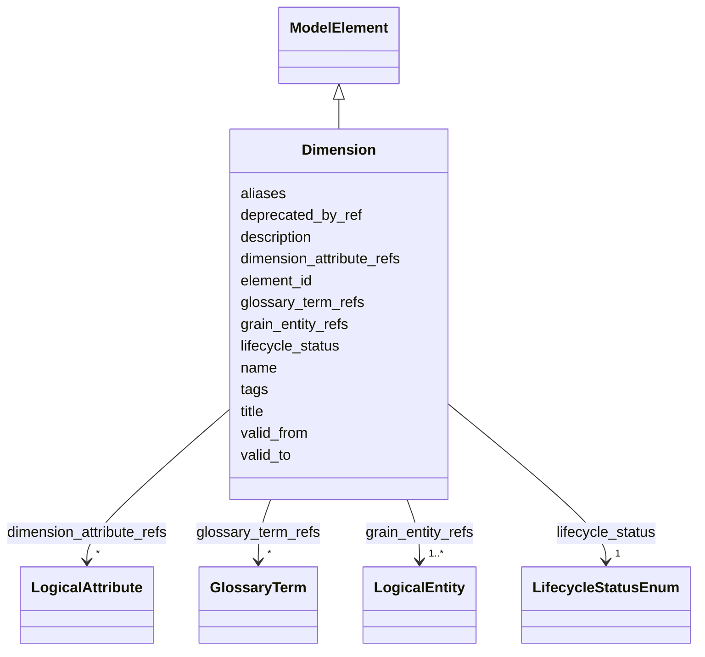

---
search:
  boost: 10.0
---

# Class: Dimension 


_Переиспользуемое аналитическое измерение, связанное с логическими атрибутами._


<div data-search-exclude markdown="1">


URI: [dams:Dimension](https://data.moex.com/dams/Dimension)





## Inheritance
* [ModelElement](ModelElement.md) [ [HasLifecycle](HasLifecycle.md)]
    * **Dimension**


## Slots

| Name | Cardinality and Range | Description | Inheritance |
| ---  | --- | --- | --- |
| [dimension_attribute_refs](dimension_attribute_refs.md) | * <br/> [LogicalAttribute](LogicalAttribute.md) |  | direct |
| [grain_entity_refs](grain_entity_refs.md) | 1..* <br/> [LogicalEntity](LogicalEntity.md) |  | direct |
| [element_id](element_id.md) | 1 <br/> [Uriorcurie](Uriorcurie.md) |  | [ModelElement](ModelElement.md) |
| [name](name.md) | 1 <br/> [String](String.md) |  | [ModelElement](ModelElement.md) |
| [title](title.md) | 0..1 <br/> [String](String.md) |  | [ModelElement](ModelElement.md) |
| [description](description.md) | 1 <br/> [String](String.md) |  | [ModelElement](ModelElement.md) |
| [aliases](aliases.md) | * <br/> [String](String.md) |  | [ModelElement](ModelElement.md) |
| [glossary_term_refs](glossary_term_refs.md) | * <br/> [GlossaryTerm](GlossaryTerm.md) |  | [ModelElement](ModelElement.md) |
| [tags](tags.md) | * <br/> [String](String.md) |  | [ModelElement](ModelElement.md) |
| [lifecycle_status](lifecycle_status.md) | 1 <br/> [LifecycleStatusEnum](LifecycleStatusEnum.md) |  | [HasLifecycle](HasLifecycle.md) |
| [valid_from](valid_from.md) | 0..1 <br/> [Datetime](Datetime.md) |  | [HasLifecycle](HasLifecycle.md) |
| [valid_to](valid_to.md) | 0..1 <br/> [Datetime](Datetime.md) |  | [HasLifecycle](HasLifecycle.md) |
| [deprecated_by_ref](deprecated_by_ref.md) | 0..1 <br/> [Uriorcurie](Uriorcurie.md) |  | [HasLifecycle](HasLifecycle.md) |


## Usages

| used by | used in | type | used |
| ---  | --- | --- | --- |
| [MOEXModelRepository](MOEXModelRepository.md) | [dimensions](dimensions.md) | range | [Dimension](Dimension.md) |


## Identifier and Mapping Information


### Schema Source


* from schema: https://data.moex.com/dams/v0.1


## Mappings

| Mapping Type | Mapped Value |
| ---  | ---  |
| self | dams:Dimension |
| native | dams:Dimension |


## LinkML Source

<!-- TODO: investigate https://stackoverflow.com/questions/37606292/how-to-create-tabbed-code-blocks-in-mkdocs-or-sphinx -->

### Direct

<details>
```yaml
name: Dimension
description: Переиспользуемое аналитическое измерение, связанное с логическими атрибутами.
from_schema: https://data.moex.com/dams/v0.1
rank: 1000
is_a: ModelElement
slots:
- dimension_attribute_refs
- grain_entity_refs

```
</details>

### Induced

<details>
```yaml
name: Dimension
description: Переиспользуемое аналитическое измерение, связанное с логическими атрибутами.
from_schema: https://data.moex.com/dams/v0.1
rank: 1000
is_a: ModelElement
attributes:
  dimension_attribute_refs:
    name: dimension_attribute_refs
    from_schema: https://data.moex.com/dams/v0.1
    rank: 1000
    owner: Dimension
    domain_of:
    - Metric
    - Dimension
    range: LogicalAttribute
    multivalued: true
    inlined: false
  grain_entity_refs:
    name: grain_entity_refs
    from_schema: https://data.moex.com/dams/v0.1
    rank: 1000
    owner: Dimension
    domain_of:
    - Metric
    - Dimension
    range: LogicalEntity
    multivalued: true
    inlined: false
    minimum_cardinality: 1
  element_id:
    name: element_id
    from_schema: https://data.moex.com/dams/v0.1
    rank: 1000
    identifier: true
    owner: Dimension
    domain_of:
    - ModelElement
    range: uriorcurie
    required: true
  name:
    name: name
    from_schema: https://data.moex.com/dams/v0.1
    rank: 1000
    owner: Dimension
    domain_of:
    - ModelElement
    - RequirementCatalog
    range: string
    required: true
  title:
    name: title
    from_schema: https://data.moex.com/dams/v0.1
    rank: 1000
    owner: Dimension
    domain_of:
    - ModelElement
    range: string
  description:
    name: description
    from_schema: https://data.moex.com/dams/v0.1
    rank: 1000
    owner: Dimension
    domain_of:
    - ModelElement
    range: string
    required: true
  aliases:
    name: aliases
    from_schema: https://data.moex.com/dams/v0.1
    rank: 1000
    owner: Dimension
    domain_of:
    - ModelElement
    range: string
    multivalued: true
  glossary_term_refs:
    name: glossary_term_refs
    from_schema: https://data.moex.com/dams/v0.1
    rank: 1000
    owner: Dimension
    domain_of:
    - ModelElement
    range: GlossaryTerm
    multivalued: true
    inlined: false
  tags:
    name: tags
    from_schema: https://data.moex.com/dams/v0.1
    rank: 1000
    owner: Dimension
    domain_of:
    - ModelElement
    range: string
    multivalued: true
  lifecycle_status:
    name: lifecycle_status
    from_schema: https://data.moex.com/dams/v0.1
    rank: 1000
    owner: Dimension
    domain_of:
    - HasLifecycle
    range: LifecycleStatusEnum
    required: true
  valid_from:
    name: valid_from
    from_schema: https://data.moex.com/dams/v0.1
    rank: 1000
    owner: Dimension
    domain_of:
    - ClassificationAssignment
    - PolicyBinding
    - HasLifecycle
    - Mapping
    range: datetime
  valid_to:
    name: valid_to
    from_schema: https://data.moex.com/dams/v0.1
    rank: 1000
    owner: Dimension
    domain_of:
    - ClassificationAssignment
    - PolicyBinding
    - HasLifecycle
    - Mapping
    range: datetime
  deprecated_by_ref:
    name: deprecated_by_ref
    from_schema: https://data.moex.com/dams/v0.1
    rank: 1000
    owner: Dimension
    domain_of:
    - HasLifecycle
    range: uriorcurie

```
</details></div>
