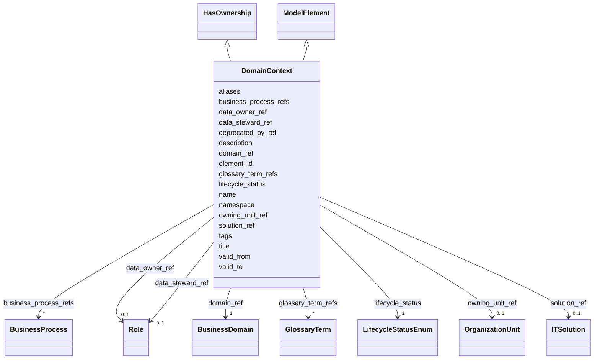

---
search:
  boost: 10.0
---

# Class: DomainContext 


_Ограниченный логический контекст с собственной терминологией и областью ответственности._


<div data-search-exclude markdown="1">


URI: [dams:DomainContext](https://data.moex.com/dams/DomainContext)





## Inheritance
* [ModelElement](ModelElement.md) [ [HasLifecycle](HasLifecycle.md)]
    * **DomainContext** [ [HasOwnership](HasOwnership.md)]


## Slots

| Name | Cardinality and Range | Description | Inheritance |
| ---  | --- | --- | --- |
| [domain_ref](domain_ref.md) | 1 <br/> [BusinessDomain](BusinessDomain.md) |  | direct |
| [solution_ref](solution_ref.md) | 0..1 <br/> [ITSolution](ITSolution.md) |  | direct |
| [namespace](namespace.md) | 1 <br/> [Uri](Uri.md) |  | direct |
| [business_process_refs](business_process_refs.md) | * <br/> [BusinessProcess](BusinessProcess.md) |  | direct |
| [data_owner_ref](data_owner_ref.md) | 0..1 <br/> [Role](Role.md) |  | [HasOwnership](HasOwnership.md) |
| [data_steward_ref](data_steward_ref.md) | 0..1 <br/> [Role](Role.md) |  | [HasOwnership](HasOwnership.md) |
| [owning_unit_ref](owning_unit_ref.md) | 0..1 <br/> [OrganizationUnit](OrganizationUnit.md) |  | [HasOwnership](HasOwnership.md) |
| [element_id](element_id.md) | 1 <br/> [Uriorcurie](Uriorcurie.md) |  | [ModelElement](ModelElement.md) |
| [name](name.md) | 1 <br/> [String](String.md) |  | [ModelElement](ModelElement.md) |
| [title](title.md) | 0..1 <br/> [String](String.md) |  | [ModelElement](ModelElement.md) |
| [description](description.md) | 1 <br/> [String](String.md) |  | [ModelElement](ModelElement.md) |
| [aliases](aliases.md) | * <br/> [String](String.md) |  | [ModelElement](ModelElement.md) |
| [glossary_term_refs](glossary_term_refs.md) | * <br/> [GlossaryTerm](GlossaryTerm.md) |  | [ModelElement](ModelElement.md) |
| [tags](tags.md) | * <br/> [String](String.md) |  | [ModelElement](ModelElement.md) |
| [lifecycle_status](lifecycle_status.md) | 1 <br/> [LifecycleStatusEnum](LifecycleStatusEnum.md) |  | [HasLifecycle](HasLifecycle.md) |
| [valid_from](valid_from.md) | 0..1 <br/> [Datetime](Datetime.md) |  | [HasLifecycle](HasLifecycle.md) |
| [valid_to](valid_to.md) | 0..1 <br/> [Datetime](Datetime.md) |  | [HasLifecycle](HasLifecycle.md) |
| [deprecated_by_ref](deprecated_by_ref.md) | 0..1 <br/> [Uriorcurie](Uriorcurie.md) |  | [HasLifecycle](HasLifecycle.md) |


## Usages

| used by | used in | type | used |
| ---  | --- | --- | --- |
| [ModelPackage](ModelPackage.md) | [domain_contexts](domain_contexts.md) | range | [DomainContext](DomainContext.md) |
| [LogicalEntity](LogicalEntity.md) | [context_ref](context_ref.md) | range | [DomainContext](DomainContext.md) |


## Identifier and Mapping Information


### Schema Source


* from schema: https://data.moex.com/dams/v0.1


## Mappings

| Mapping Type | Mapped Value |
| ---  | ---  |
| self | dams:DomainContext |
| native | dams:DomainContext |


## LinkML Source

<!-- TODO: investigate https://stackoverflow.com/questions/37606292/how-to-create-tabbed-code-blocks-in-mkdocs-or-sphinx -->

### Direct

<details>
```yaml
name: DomainContext
description: Ограниченный логический контекст с собственной терминологией и областью
  ответственности.
from_schema: https://data.moex.com/dams/v0.1
rank: 1000
is_a: ModelElement
mixins:
- HasOwnership
slots:
- domain_ref
- solution_ref
- namespace
- business_process_refs

```
</details>

### Induced

<details>
```yaml
name: DomainContext
description: Ограниченный логический контекст с собственной терминологией и областью
  ответственности.
from_schema: https://data.moex.com/dams/v0.1
rank: 1000
is_a: ModelElement
mixins:
- HasOwnership
attributes:
  domain_ref:
    name: domain_ref
    from_schema: https://data.moex.com/dams/v0.1
    rank: 1000
    owner: DomainContext
    domain_of:
    - DomainContext
    range: BusinessDomain
    required: true
    inlined: false
  solution_ref:
    name: solution_ref
    from_schema: https://data.moex.com/dams/v0.1
    rank: 1000
    owner: DomainContext
    domain_of:
    - ModelPackage
    - DomainContext
    - LogicalEntity
    - PhysicalObject
    range: ITSolution
    inlined: false
  namespace:
    name: namespace
    from_schema: https://data.moex.com/dams/v0.1
    rank: 1000
    owner: DomainContext
    domain_of:
    - DomainContext
    range: uri
    required: true
  business_process_refs:
    name: business_process_refs
    from_schema: https://data.moex.com/dams/v0.1
    rank: 1000
    owner: DomainContext
    domain_of:
    - DomainContext
    range: BusinessProcess
    multivalued: true
    inlined: false
  data_owner_ref:
    name: data_owner_ref
    from_schema: https://data.moex.com/dams/v0.1
    rank: 1000
    owner: DomainContext
    domain_of:
    - HasOwnership
    range: Role
    inlined: false
  data_steward_ref:
    name: data_steward_ref
    from_schema: https://data.moex.com/dams/v0.1
    rank: 1000
    owner: DomainContext
    domain_of:
    - HasOwnership
    range: Role
    inlined: false
  owning_unit_ref:
    name: owning_unit_ref
    from_schema: https://data.moex.com/dams/v0.1
    rank: 1000
    owner: DomainContext
    domain_of:
    - HasOwnership
    range: OrganizationUnit
    inlined: false
  element_id:
    name: element_id
    from_schema: https://data.moex.com/dams/v0.1
    rank: 1000
    identifier: true
    owner: DomainContext
    domain_of:
    - ModelElement
    range: uriorcurie
    required: true
  name:
    name: name
    from_schema: https://data.moex.com/dams/v0.1
    rank: 1000
    owner: DomainContext
    domain_of:
    - ModelElement
    - RequirementCatalog
    range: string
    required: true
  title:
    name: title
    from_schema: https://data.moex.com/dams/v0.1
    rank: 1000
    owner: DomainContext
    domain_of:
    - ModelElement
    range: string
  description:
    name: description
    from_schema: https://data.moex.com/dams/v0.1
    rank: 1000
    owner: DomainContext
    domain_of:
    - ModelElement
    range: string
    required: true
  aliases:
    name: aliases
    from_schema: https://data.moex.com/dams/v0.1
    rank: 1000
    owner: DomainContext
    domain_of:
    - ModelElement
    range: string
    multivalued: true
  glossary_term_refs:
    name: glossary_term_refs
    from_schema: https://data.moex.com/dams/v0.1
    rank: 1000
    owner: DomainContext
    domain_of:
    - ModelElement
    range: GlossaryTerm
    multivalued: true
    inlined: false
  tags:
    name: tags
    from_schema: https://data.moex.com/dams/v0.1
    rank: 1000
    owner: DomainContext
    domain_of:
    - ModelElement
    range: string
    multivalued: true
  lifecycle_status:
    name: lifecycle_status
    from_schema: https://data.moex.com/dams/v0.1
    rank: 1000
    owner: DomainContext
    domain_of:
    - HasLifecycle
    range: LifecycleStatusEnum
    required: true
  valid_from:
    name: valid_from
    from_schema: https://data.moex.com/dams/v0.1
    rank: 1000
    owner: DomainContext
    domain_of:
    - ClassificationAssignment
    - PolicyBinding
    - HasLifecycle
    - Mapping
    range: datetime
  valid_to:
    name: valid_to
    from_schema: https://data.moex.com/dams/v0.1
    rank: 1000
    owner: DomainContext
    domain_of:
    - ClassificationAssignment
    - PolicyBinding
    - HasLifecycle
    - Mapping
    range: datetime
  deprecated_by_ref:
    name: deprecated_by_ref
    from_schema: https://data.moex.com/dams/v0.1
    rank: 1000
    owner: DomainContext
    domain_of:
    - HasLifecycle
    range: uriorcurie

```
</details></div>
