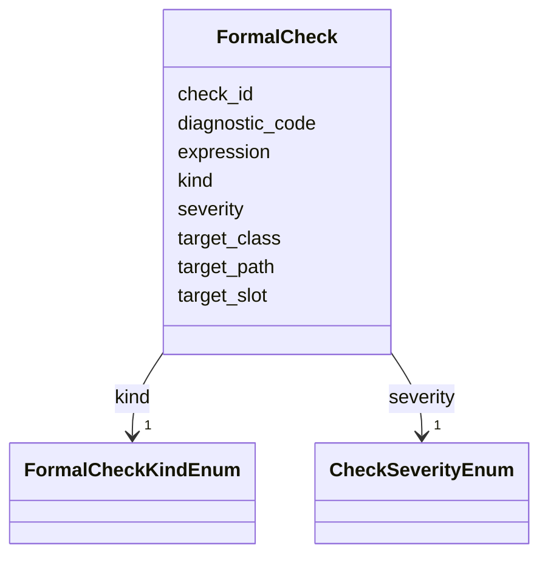

---
search:
  boost: 10.0
---

# Class: FormalCheck 


_Одна машиночитаемая проверка требования. Kind выровнен с LinkML constraints и DAMS reference/structural diagnostics; assess wiring может появиться позже._


<div data-search-exclude markdown="1">


URI: [dams:FormalCheck](https://data.moex.com/dams/FormalCheck)





<!-- no inheritance hierarchy -->

## Slots

| Name | Cardinality and Range | Description | Inheritance |
| ---  | --- | --- | --- |
| [check_id](check_id.md) | 1 <br/> [String](String.md) |  | direct |
| [kind](kind.md) | 1 <br/> [FormalCheckKindEnum](FormalCheckKindEnum.md) |  | direct |
| [target_class](target_class.md) | 0..1 <br/> [String](String.md) | Имя класса LinkML (например LogicalEntity) | direct |
| [target_slot](target_slot.md) | 0..1 <br/> [String](String.md) |  | direct |
| [target_path](target_path.md) | 0..1 <br/> [String](String.md) | JSON Pointer или path hint в теле ModelPackage | direct |
| [severity](severity.md) | 1 <br/> [CheckSeverityEnum](CheckSeverityEnum.md) |  | direct |
| [diagnostic_code](diagnostic_code.md) | 0..1 <br/> [String](String.md) | Мост к DAMS-STRUCT-* / DAMS-REF-* / будущим DAMS-REQ-* | direct |
| [expression](expression.md) | 0..1 <br/> [String](String.md) | Свободная LinkML-ish заметка при kind=custom | direct |


## Usages

| used by | used in | type | used |
| ---  | --- | --- | --- |
| [SpecificationRequirement](SpecificationRequirement.md) | [formal_checks](formal_checks.md) | range | [FormalCheck](FormalCheck.md) |


## Identifier and Mapping Information


### Schema Source


* from schema: https://data.moex.com/dams/v0.1


## Mappings

| Mapping Type | Mapped Value |
| ---  | ---  |
| self | dams:FormalCheck |
| native | dams:FormalCheck |


## LinkML Source

<!-- TODO: investigate https://stackoverflow.com/questions/37606292/how-to-create-tabbed-code-blocks-in-mkdocs-or-sphinx -->

### Direct

<details>
```yaml
name: FormalCheck
description: Одна машиночитаемая проверка требования. Kind выровнен с LinkML constraints
  и DAMS reference/structural diagnostics; assess wiring может появиться позже.
from_schema: https://data.moex.com/dams/v0.1
rank: 1000
slots:
- check_id
- kind
- target_class
- target_slot
- target_path
- severity
- diagnostic_code
- expression

```
</details>

### Induced

<details>
```yaml
name: FormalCheck
description: Одна машиночитаемая проверка требования. Kind выровнен с LinkML constraints
  и DAMS reference/structural diagnostics; assess wiring может появиться позже.
from_schema: https://data.moex.com/dams/v0.1
rank: 1000
attributes:
  check_id:
    name: check_id
    from_schema: https://data.moex.com/dams/v0.1
    rank: 1000
    identifier: true
    owner: FormalCheck
    domain_of:
    - FormalCheck
    range: string
    required: true
  kind:
    name: kind
    from_schema: https://data.moex.com/dams/v0.1
    rank: 1000
    owner: FormalCheck
    domain_of:
    - FormalCheck
    range: FormalCheckKindEnum
    required: true
  target_class:
    name: target_class
    description: Имя класса LinkML (например LogicalEntity).
    from_schema: https://data.moex.com/dams/v0.1
    rank: 1000
    owner: FormalCheck
    domain_of:
    - FormalCheck
    range: string
  target_slot:
    name: target_slot
    from_schema: https://data.moex.com/dams/v0.1
    rank: 1000
    owner: FormalCheck
    domain_of:
    - FormalCheck
    range: string
  target_path:
    name: target_path
    description: JSON Pointer или path hint в теле ModelPackage.
    from_schema: https://data.moex.com/dams/v0.1
    rank: 1000
    owner: FormalCheck
    domain_of:
    - FormalCheck
    range: string
  severity:
    name: severity
    from_schema: https://data.moex.com/dams/v0.1
    rank: 1000
    owner: FormalCheck
    domain_of:
    - FormalCheck
    range: CheckSeverityEnum
    required: true
  diagnostic_code:
    name: diagnostic_code
    description: Мост к DAMS-STRUCT-* / DAMS-REF-* / будущим DAMS-REQ-*.
    from_schema: https://data.moex.com/dams/v0.1
    rank: 1000
    owner: FormalCheck
    domain_of:
    - FormalCheck
    range: string
  expression:
    name: expression
    description: Свободная LinkML-ish заметка при kind=custom.
    from_schema: https://data.moex.com/dams/v0.1
    rank: 1000
    owner: FormalCheck
    domain_of:
    - FormalCheck
    range: string

```
</details></div>
