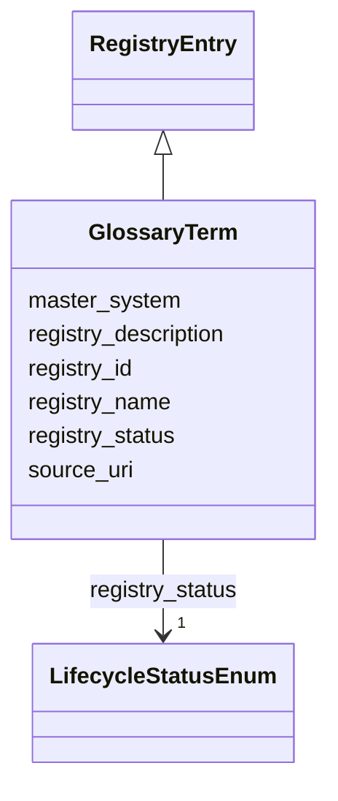

---
search:
  boost: 10.0
---

# Class: GlossaryTerm 


_Термин корпоративного бизнес-глоссария._


<div data-search-exclude markdown="1">


URI: [dams:GlossaryTerm](https://data.moex.com/dams/GlossaryTerm)





## Inheritance
* [RegistryEntry](RegistryEntry.md)
    * **GlossaryTerm**


## Slots

| Name | Cardinality and Range | Description | Inheritance |
| ---  | --- | --- | --- |
| [registry_id](registry_id.md) | 1 <br/> [Uriorcurie](Uriorcurie.md) |  | [RegistryEntry](RegistryEntry.md) |
| [registry_name](registry_name.md) | 1 <br/> [String](String.md) |  | [RegistryEntry](RegistryEntry.md) |
| [registry_description](registry_description.md) | 0..1 <br/> [String](String.md) |  | [RegistryEntry](RegistryEntry.md) |
| [master_system](master_system.md) | 1 <br/> [String](String.md) |  | [RegistryEntry](RegistryEntry.md) |
| [source_uri](source_uri.md) | 0..1 <br/> [Uri](Uri.md) |  | [RegistryEntry](RegistryEntry.md) |
| [registry_status](registry_status.md) | 1 <br/> [LifecycleStatusEnum](LifecycleStatusEnum.md) |  | [RegistryEntry](RegistryEntry.md) |


## Usages

| used by | used in | type | used |
| ---  | --- | --- | --- |
| [ModelElement](ModelElement.md) | [glossary_term_refs](glossary_term_refs.md) | range | [GlossaryTerm](GlossaryTerm.md) |
| [ModelPackage](ModelPackage.md) | [glossary_term_refs](glossary_term_refs.md) | range | [GlossaryTerm](GlossaryTerm.md) |
| [DomainContext](DomainContext.md) | [glossary_term_refs](glossary_term_refs.md) | range | [GlossaryTerm](GlossaryTerm.md) |
| [ConceptualEntity](ConceptualEntity.md) | [glossary_term_refs](glossary_term_refs.md) | range | [GlossaryTerm](GlossaryTerm.md) |
| [LogicalEntity](LogicalEntity.md) | [glossary_term_refs](glossary_term_refs.md) | range | [GlossaryTerm](GlossaryTerm.md) |
| [LogicalAttribute](LogicalAttribute.md) | [glossary_term_refs](glossary_term_refs.md) | range | [GlossaryTerm](GlossaryTerm.md) |
| [Relationship](Relationship.md) | [glossary_term_refs](glossary_term_refs.md) | range | [GlossaryTerm](GlossaryTerm.md) |
| [PhysicalObject](PhysicalObject.md) | [glossary_term_refs](glossary_term_refs.md) | range | [GlossaryTerm](GlossaryTerm.md) |
| [PhysicalField](PhysicalField.md) | [glossary_term_refs](glossary_term_refs.md) | range | [GlossaryTerm](GlossaryTerm.md) |
| [Mapping](Mapping.md) | [glossary_term_refs](glossary_term_refs.md) | range | [GlossaryTerm](GlossaryTerm.md) |
| [DataFlow](DataFlow.md) | [glossary_term_refs](glossary_term_refs.md) | range | [GlossaryTerm](GlossaryTerm.md) |
| [DataFlowEntityBinding](DataFlowEntityBinding.md) | [glossary_term_refs](glossary_term_refs.md) | range | [GlossaryTerm](GlossaryTerm.md) |
| [DataModelBinding](DataModelBinding.md) | [glossary_term_refs](glossary_term_refs.md) | range | [GlossaryTerm](GlossaryTerm.md) |
| [ModelSelection](ModelSelection.md) | [glossary_term_refs](glossary_term_refs.md) | range | [GlossaryTerm](GlossaryTerm.md) |
| [SelectedEntity](SelectedEntity.md) | [glossary_term_refs](glossary_term_refs.md) | range | [GlossaryTerm](GlossaryTerm.md) |
| [SelectedAttribute](SelectedAttribute.md) | [glossary_term_refs](glossary_term_refs.md) | range | [GlossaryTerm](GlossaryTerm.md) |
| [Metric](Metric.md) | [glossary_term_refs](glossary_term_refs.md) | range | [GlossaryTerm](GlossaryTerm.md) |
| [Dimension](Dimension.md) | [glossary_term_refs](glossary_term_refs.md) | range | [GlossaryTerm](GlossaryTerm.md) |
| [SpecificationRequirement](SpecificationRequirement.md) | [glossary_term_refs](glossary_term_refs.md) | range | [GlossaryTerm](GlossaryTerm.md) |


## Identifier and Mapping Information


### Schema Source


* from schema: https://data.moex.com/dams/v0.1


## Mappings

| Mapping Type | Mapped Value |
| ---  | ---  |
| self | dams:GlossaryTerm |
| native | dams:GlossaryTerm |


## LinkML Source

<!-- TODO: investigate https://stackoverflow.com/questions/37606292/how-to-create-tabbed-code-blocks-in-mkdocs-or-sphinx -->

### Direct

<details>
```yaml
name: GlossaryTerm
description: Термин корпоративного бизнес-глоссария.
from_schema: https://data.moex.com/dams/v0.1
rank: 1000
is_a: RegistryEntry

```
</details>

### Induced

<details>
```yaml
name: GlossaryTerm
description: Термин корпоративного бизнес-глоссария.
from_schema: https://data.moex.com/dams/v0.1
rank: 1000
is_a: RegistryEntry
attributes:
  registry_id:
    name: registry_id
    from_schema: https://data.moex.com/dams/v0.1
    rank: 1000
    identifier: true
    owner: GlossaryTerm
    domain_of:
    - RegistryEntry
    range: uriorcurie
    required: true
  registry_name:
    name: registry_name
    from_schema: https://data.moex.com/dams/v0.1
    rank: 1000
    owner: GlossaryTerm
    domain_of:
    - RegistryEntry
    range: string
    required: true
  registry_description:
    name: registry_description
    from_schema: https://data.moex.com/dams/v0.1
    rank: 1000
    owner: GlossaryTerm
    domain_of:
    - RegistryEntry
    range: string
  master_system:
    name: master_system
    from_schema: https://data.moex.com/dams/v0.1
    rank: 1000
    owner: GlossaryTerm
    domain_of:
    - RegistryEntry
    range: string
    required: true
  source_uri:
    name: source_uri
    from_schema: https://data.moex.com/dams/v0.1
    rank: 1000
    owner: GlossaryTerm
    domain_of:
    - RegistryEntry
    range: uri
  registry_status:
    name: registry_status
    from_schema: https://data.moex.com/dams/v0.1
    rank: 1000
    owner: GlossaryTerm
    domain_of:
    - RegistryEntry
    range: LifecycleStatusEnum
    required: true

```
</details></div>
