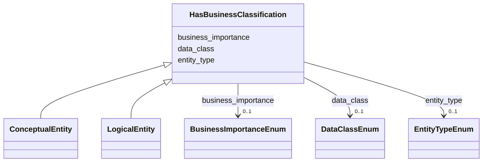

---
search:
  boost: 10.0
---

# Class: HasBusinessClassification 


_Классификация роли и бизнес-значимости логической сущности._


<div data-search-exclude markdown="1">


URI: [dams:HasBusinessClassification](https://data.moex.com/dams/HasBusinessClassification)





<!-- no inheritance hierarchy -->

## Class Properties

| Property | Value |
| --- | --- |
| Mixin | Yes |


## Slots

| Name | Cardinality and Range | Description | Inheritance |
| ---  | --- | --- | --- |
| [entity_type](entity_type.md) | 0..1 <br/> [EntityTypeEnum](EntityTypeEnum.md) |  | direct |
| [data_class](data_class.md) | 0..1 <br/> [DataClassEnum](DataClassEnum.md) |  | direct |
| [business_importance](business_importance.md) | 0..1 <br/> [BusinessImportanceEnum](BusinessImportanceEnum.md) |  | direct |


## Mixin Usage

| mixed into | description |
| --- | --- |
| [ConceptualEntity](ConceptualEntity.md) | Корпоративное бизнес-понятие верхнего уровня, независимое от конкретной реали... |
| [LogicalEntity](LogicalEntity.md) | Представление бизнес-сущности в доменном контексте и модели конкретного решен... |


## Identifier and Mapping Information


### Schema Source


* from schema: https://data.moex.com/dams/v0.1


## Mappings

| Mapping Type | Mapped Value |
| ---  | ---  |
| self | dams:HasBusinessClassification |
| native | dams:HasBusinessClassification |


## LinkML Source

<!-- TODO: investigate https://stackoverflow.com/questions/37606292/how-to-create-tabbed-code-blocks-in-mkdocs-or-sphinx -->

### Direct

<details>
```yaml
name: HasBusinessClassification
description: Классификация роли и бизнес-значимости логической сущности.
from_schema: https://data.moex.com/dams/v0.1
rank: 1000
mixin: true
slots:
- entity_type
- data_class
- business_importance

```
</details>

### Induced

<details>
```yaml
name: HasBusinessClassification
description: Классификация роли и бизнес-значимости логической сущности.
from_schema: https://data.moex.com/dams/v0.1
rank: 1000
mixin: true
attributes:
  entity_type:
    name: entity_type
    from_schema: https://data.moex.com/dams/v0.1
    rank: 1000
    owner: HasBusinessClassification
    domain_of:
    - HasBusinessClassification
    range: EntityTypeEnum
  data_class:
    name: data_class
    from_schema: https://data.moex.com/dams/v0.1
    rank: 1000
    owner: HasBusinessClassification
    domain_of:
    - HasBusinessClassification
    range: DataClassEnum
  business_importance:
    name: business_importance
    from_schema: https://data.moex.com/dams/v0.1
    rank: 1000
    owner: HasBusinessClassification
    domain_of:
    - HasBusinessClassification
    range: BusinessImportanceEnum

```
</details></div>
