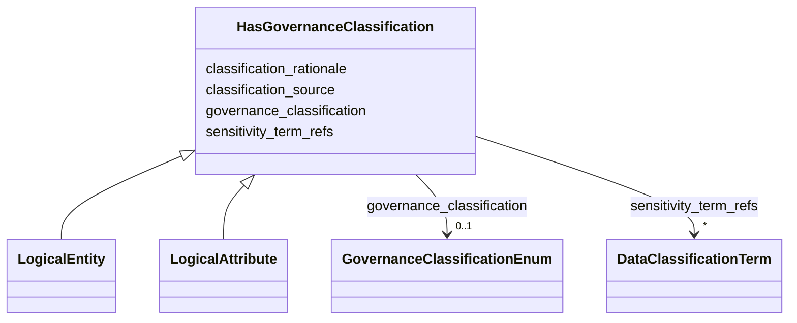

---
search:
  boost: 10.0
---

# Class: HasGovernanceClassification 


_Базовая и специальная классификация чувствительности данных._


<div data-search-exclude markdown="1">


URI: [dams:HasGovernanceClassification](https://data.moex.com/dams/HasGovernanceClassification)





<!-- no inheritance hierarchy -->

## Class Properties

| Property | Value |
| --- | --- |
| Mixin | Yes |


## Slots

| Name | Cardinality and Range | Description | Inheritance |
| ---  | --- | --- | --- |
| [governance_classification](governance_classification.md) | 0..1 <br/> [GovernanceClassificationEnum](GovernanceClassificationEnum.md) |  | direct |
| [sensitivity_term_refs](sensitivity_term_refs.md) | * <br/> [DataClassificationTerm](DataClassificationTerm.md) |  | direct |
| [classification_source](classification_source.md) | 0..1 <br/> [String](String.md) |  | direct |
| [classification_rationale](classification_rationale.md) | 0..1 <br/> [String](String.md) |  | direct |


## Mixin Usage

| mixed into | description |
| --- | --- |
| [LogicalEntity](LogicalEntity.md) | Представление бизнес-сущности в доменном контексте и модели конкретного решен... |
| [LogicalAttribute](LogicalAttribute.md) | Логический атрибут сущности с бизнес-смыслом, типом, обязательностью и класси... |


## Identifier and Mapping Information


### Schema Source


* from schema: https://data.moex.com/dams/v0.1


## Mappings

| Mapping Type | Mapped Value |
| ---  | ---  |
| self | dams:HasGovernanceClassification |
| native | dams:HasGovernanceClassification |


## LinkML Source

<!-- TODO: investigate https://stackoverflow.com/questions/37606292/how-to-create-tabbed-code-blocks-in-mkdocs-or-sphinx -->

### Direct

<details>
```yaml
name: HasGovernanceClassification
description: Базовая и специальная классификация чувствительности данных.
from_schema: https://data.moex.com/dams/v0.1
rank: 1000
mixin: true
slots:
- governance_classification
- sensitivity_term_refs
- classification_source
- classification_rationale

```
</details>

### Induced

<details>
```yaml
name: HasGovernanceClassification
description: Базовая и специальная классификация чувствительности данных.
from_schema: https://data.moex.com/dams/v0.1
rank: 1000
mixin: true
attributes:
  governance_classification:
    name: governance_classification
    from_schema: https://data.moex.com/dams/v0.1
    rank: 1000
    owner: HasGovernanceClassification
    domain_of:
    - ClassificationAssignment
    - HasGovernanceClassification
    range: GovernanceClassificationEnum
  sensitivity_term_refs:
    name: sensitivity_term_refs
    from_schema: https://data.moex.com/dams/v0.1
    rank: 1000
    owner: HasGovernanceClassification
    domain_of:
    - HasGovernanceClassification
    range: DataClassificationTerm
    multivalued: true
    inlined: false
  classification_source:
    name: classification_source
    from_schema: https://data.moex.com/dams/v0.1
    rank: 1000
    owner: HasGovernanceClassification
    domain_of:
    - ClassificationAssignment
    - HasGovernanceClassification
    range: string
  classification_rationale:
    name: classification_rationale
    from_schema: https://data.moex.com/dams/v0.1
    rank: 1000
    owner: HasGovernanceClassification
    domain_of:
    - ClassificationAssignment
    - HasGovernanceClassification
    range: string

```
</details></div>
