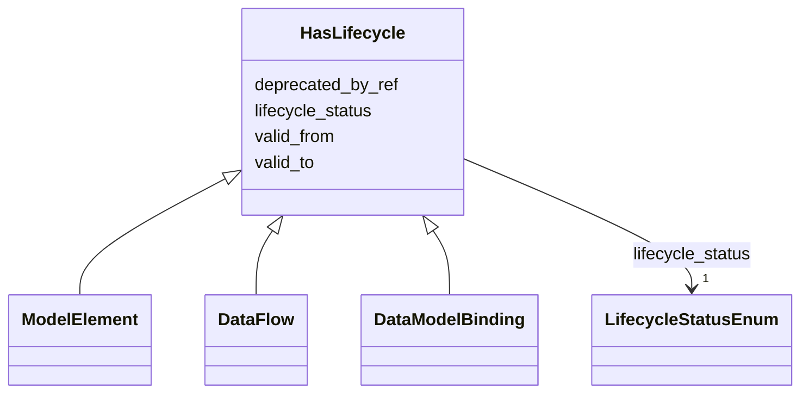

---
search:
  boost: 10.0
---

# Class: HasLifecycle 


_Mixin жизненного цикла: статус, период действия и ссылка на заменяющий элемент._


<div data-search-exclude markdown="1">


URI: [dams:HasLifecycle](https://data.moex.com/dams/HasLifecycle)





<!-- no inheritance hierarchy -->

## Class Properties

| Property | Value |
| --- | --- |
| Mixin | Yes |


## Slots

| Name | Cardinality and Range | Description | Inheritance |
| ---  | --- | --- | --- |
| [lifecycle_status](lifecycle_status.md) | 1 <br/> [LifecycleStatusEnum](LifecycleStatusEnum.md) |  | direct |
| [valid_from](valid_from.md) | 0..1 <br/> [Datetime](Datetime.md) |  | direct |
| [valid_to](valid_to.md) | 0..1 <br/> [Datetime](Datetime.md) |  | direct |
| [deprecated_by_ref](deprecated_by_ref.md) | 0..1 <br/> [Uriorcurie](Uriorcurie.md) |  | direct |


## Mixin Usage

| mixed into | description |
| --- | --- |
| [ModelElement](ModelElement.md) | Абстрактный корень иерархии элементов модели: общая идентичность (element_id)... |
| [DataFlow](DataFlow.md) | Ссылочная проекция зарегистрированной интеграции; топология и канал являются ... |
| [DataModelBinding](DataModelBinding.md) | Дочерняя модельная спецификация дата-контракта, фиксирующая неизменяемую реви... |


## Identifier and Mapping Information


### Schema Source


* from schema: https://data.moex.com/dams/v0.1


## Mappings

| Mapping Type | Mapped Value |
| ---  | ---  |
| self | dams:HasLifecycle |
| native | dams:HasLifecycle |


## LinkML Source

<!-- TODO: investigate https://stackoverflow.com/questions/37606292/how-to-create-tabbed-code-blocks-in-mkdocs-or-sphinx -->

### Direct

<details>
```yaml
name: HasLifecycle
description: 'Mixin жизненного цикла: статус, период действия и ссылка на заменяющий
  элемент.'
from_schema: https://data.moex.com/dams/v0.1
rank: 1000
mixin: true
slots:
- lifecycle_status
- valid_from
- valid_to
- deprecated_by_ref

```
</details>

### Induced

<details>
```yaml
name: HasLifecycle
description: 'Mixin жизненного цикла: статус, период действия и ссылка на заменяющий
  элемент.'
from_schema: https://data.moex.com/dams/v0.1
rank: 1000
mixin: true
attributes:
  lifecycle_status:
    name: lifecycle_status
    from_schema: https://data.moex.com/dams/v0.1
    rank: 1000
    owner: HasLifecycle
    domain_of:
    - HasLifecycle
    range: LifecycleStatusEnum
    required: true
  valid_from:
    name: valid_from
    from_schema: https://data.moex.com/dams/v0.1
    rank: 1000
    owner: HasLifecycle
    domain_of:
    - ClassificationAssignment
    - PolicyBinding
    - HasLifecycle
    - Mapping
    range: datetime
  valid_to:
    name: valid_to
    from_schema: https://data.moex.com/dams/v0.1
    rank: 1000
    owner: HasLifecycle
    domain_of:
    - ClassificationAssignment
    - PolicyBinding
    - HasLifecycle
    - Mapping
    range: datetime
  deprecated_by_ref:
    name: deprecated_by_ref
    from_schema: https://data.moex.com/dams/v0.1
    rank: 1000
    owner: HasLifecycle
    domain_of:
    - HasLifecycle
    range: uriorcurie

```
</details></div>
