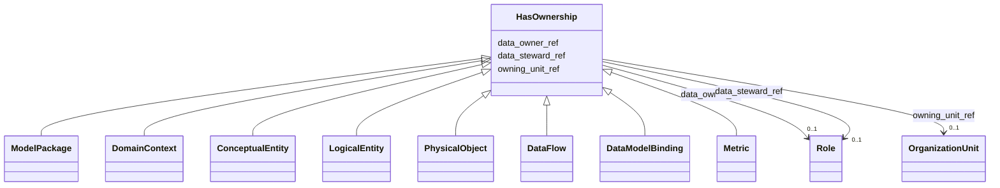

---
search:
  boost: 10.0
---

# Class: HasOwnership 


_Mixin владения: data owner, data steward и организационное подразделение._


<div data-search-exclude markdown="1">


URI: [dams:HasOwnership](https://data.moex.com/dams/HasOwnership)





<!-- no inheritance hierarchy -->

## Class Properties

| Property | Value |
| --- | --- |
| Mixin | Yes |


## Slots

| Name | Cardinality and Range | Description | Inheritance |
| ---  | --- | --- | --- |
| [data_owner_ref](data_owner_ref.md) | 0..1 <br/> [Role](Role.md) |  | direct |
| [data_steward_ref](data_steward_ref.md) | 0..1 <br/> [Role](Role.md) |  | direct |
| [owning_unit_ref](owning_unit_ref.md) | 0..1 <br/> [OrganizationUnit](OrganizationUnit.md) |  | direct |


## Mixin Usage

| mixed into | description |
| --- | --- |
| [ModelPackage](ModelPackage.md) | Версионируемый артефакт модели данных одного ИТ-решения или корпоративной мод... |
| [DomainContext](DomainContext.md) | Ограниченный логический контекст с собственной терминологией и областью ответ... |
| [ConceptualEntity](ConceptualEntity.md) | Корпоративное бизнес-понятие верхнего уровня, независимое от конкретной реали... |
| [LogicalEntity](LogicalEntity.md) | Представление бизнес-сущности в доменном контексте и модели конкретного решен... |
| [PhysicalObject](PhysicalObject.md) | Квант данных или техническая точка публикации/потребления |
| [DataFlow](DataFlow.md) | Ссылочная проекция зарегистрированной интеграции; топология и канал являются ... |
| [DataModelBinding](DataModelBinding.md) | Дочерняя модельная спецификация дата-контракта, фиксирующая неизменяемую реви... |
| [Metric](Metric.md) | Управляемое определение бизнес- или технической метрики; является опциональны... |


## Identifier and Mapping Information


### Schema Source


* from schema: https://data.moex.com/dams/v0.1


## Mappings

| Mapping Type | Mapped Value |
| ---  | ---  |
| self | dams:HasOwnership |
| native | dams:HasOwnership |


## LinkML Source

<!-- TODO: investigate https://stackoverflow.com/questions/37606292/how-to-create-tabbed-code-blocks-in-mkdocs-or-sphinx -->

### Direct

<details>
```yaml
name: HasOwnership
description: 'Mixin владения: data owner, data steward и организационное подразделение.'
from_schema: https://data.moex.com/dams/v0.1
rank: 1000
mixin: true
slots:
- data_owner_ref
- data_steward_ref
- owning_unit_ref

```
</details>

### Induced

<details>
```yaml
name: HasOwnership
description: 'Mixin владения: data owner, data steward и организационное подразделение.'
from_schema: https://data.moex.com/dams/v0.1
rank: 1000
mixin: true
attributes:
  data_owner_ref:
    name: data_owner_ref
    from_schema: https://data.moex.com/dams/v0.1
    rank: 1000
    owner: HasOwnership
    domain_of:
    - HasOwnership
    range: Role
    inlined: false
  data_steward_ref:
    name: data_steward_ref
    from_schema: https://data.moex.com/dams/v0.1
    rank: 1000
    owner: HasOwnership
    domain_of:
    - HasOwnership
    range: Role
    inlined: false
  owning_unit_ref:
    name: owning_unit_ref
    from_schema: https://data.moex.com/dams/v0.1
    rank: 1000
    owner: HasOwnership
    domain_of:
    - HasOwnership
    range: OrganizationUnit
    inlined: false

```
</details></div>
