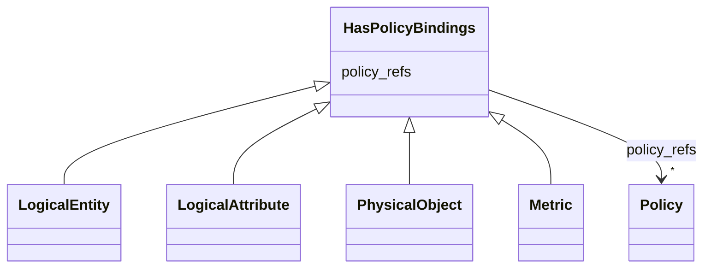

---
search:
  boost: 10.0
---

# Class: HasPolicyBindings 


_Mixin привязки управляемых политик к элементу модели._


<div data-search-exclude markdown="1">


URI: [dams:HasPolicyBindings](https://data.moex.com/dams/HasPolicyBindings)





<!-- no inheritance hierarchy -->

## Class Properties

| Property | Value |
| --- | --- |
| Mixin | Yes |


## Slots

| Name | Cardinality and Range | Description | Inheritance |
| ---  | --- | --- | --- |
| [policy_refs](policy_refs.md) | * <br/> [Policy](Policy.md) |  | direct |


## Mixin Usage

| mixed into | description |
| --- | --- |
| [LogicalEntity](LogicalEntity.md) | Представление бизнес-сущности в доменном контексте и модели конкретного решен... |
| [LogicalAttribute](LogicalAttribute.md) | Логический атрибут сущности с бизнес-смыслом, типом, обязательностью и класси... |
| [PhysicalObject](PhysicalObject.md) | Квант данных или техническая точка публикации/потребления |
| [Metric](Metric.md) | Управляемое определение бизнес- или технической метрики; является опциональны... |


## Identifier and Mapping Information


### Schema Source


* from schema: https://data.moex.com/dams/v0.1


## Mappings

| Mapping Type | Mapped Value |
| ---  | ---  |
| self | dams:HasPolicyBindings |
| native | dams:HasPolicyBindings |


## LinkML Source

<!-- TODO: investigate https://stackoverflow.com/questions/37606292/how-to-create-tabbed-code-blocks-in-mkdocs-or-sphinx -->

### Direct

<details>
```yaml
name: HasPolicyBindings
description: Mixin привязки управляемых политик к элементу модели.
from_schema: https://data.moex.com/dams/v0.1
rank: 1000
mixin: true
slots:
- policy_refs

```
</details>

### Induced

<details>
```yaml
name: HasPolicyBindings
description: Mixin привязки управляемых политик к элементу модели.
from_schema: https://data.moex.com/dams/v0.1
rank: 1000
mixin: true
attributes:
  policy_refs:
    name: policy_refs
    from_schema: https://data.moex.com/dams/v0.1
    rank: 1000
    owner: HasPolicyBindings
    domain_of:
    - HasPolicyBindings
    range: Policy
    multivalued: true
    inlined: false

```
</details></div>
