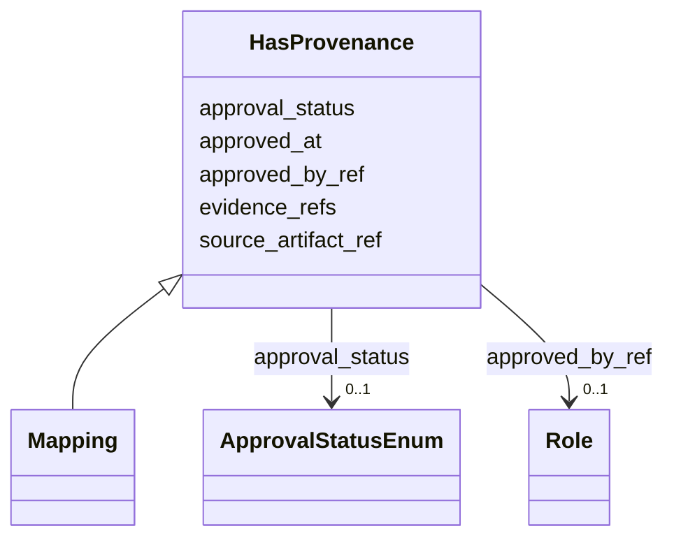

---
search:
  boost: 10.0
---

# Class: HasProvenance 


_Mixin происхождения и согласования: исходный артефакт, evidence, статус и согласующий._


<div data-search-exclude markdown="1">


URI: [dams:HasProvenance](https://data.moex.com/dams/HasProvenance)





<!-- no inheritance hierarchy -->

## Class Properties

| Property | Value |
| --- | --- |
| Mixin | Yes |


## Slots

| Name | Cardinality and Range | Description | Inheritance |
| ---  | --- | --- | --- |
| [source_artifact_ref](source_artifact_ref.md) | 0..1 <br/> [Uri](Uri.md) |  | direct |
| [evidence_refs](evidence_refs.md) | * <br/> [Uri](Uri.md) |  | direct |
| [approval_status](approval_status.md) | 0..1 <br/> [ApprovalStatusEnum](ApprovalStatusEnum.md) |  | direct |
| [approved_by_ref](approved_by_ref.md) | 0..1 <br/> [Role](Role.md) |  | direct |
| [approved_at](approved_at.md) | 0..1 <br/> [Datetime](Datetime.md) |  | direct |


## Mixin Usage

| mixed into | description |
| --- | --- |
| [Mapping](Mapping.md) | Явное соответствие между элементами концептуального, логического и физическог... |


## Identifier and Mapping Information


### Schema Source


* from schema: https://data.moex.com/dams/v0.1


## Mappings

| Mapping Type | Mapped Value |
| ---  | ---  |
| self | dams:HasProvenance |
| native | dams:HasProvenance |


## LinkML Source

<!-- TODO: investigate https://stackoverflow.com/questions/37606292/how-to-create-tabbed-code-blocks-in-mkdocs-or-sphinx -->

### Direct

<details>
```yaml
name: HasProvenance
description: 'Mixin происхождения и согласования: исходный артефакт, evidence, статус
  и согласующий.'
from_schema: https://data.moex.com/dams/v0.1
rank: 1000
mixin: true
slots:
- source_artifact_ref
- evidence_refs
- approval_status
- approved_by_ref
- approved_at

```
</details>

### Induced

<details>
```yaml
name: HasProvenance
description: 'Mixin происхождения и согласования: исходный артефакт, evidence, статус
  и согласующий.'
from_schema: https://data.moex.com/dams/v0.1
rank: 1000
mixin: true
attributes:
  source_artifact_ref:
    name: source_artifact_ref
    from_schema: https://data.moex.com/dams/v0.1
    rank: 1000
    owner: HasProvenance
    domain_of:
    - HasProvenance
    range: uri
  evidence_refs:
    name: evidence_refs
    from_schema: https://data.moex.com/dams/v0.1
    rank: 1000
    owner: HasProvenance
    domain_of:
    - HasProvenance
    range: uri
    multivalued: true
  approval_status:
    name: approval_status
    from_schema: https://data.moex.com/dams/v0.1
    rank: 1000
    owner: HasProvenance
    domain_of:
    - ClassificationAssignment
    - PolicyBinding
    - HasProvenance
    range: ApprovalStatusEnum
  approved_by_ref:
    name: approved_by_ref
    from_schema: https://data.moex.com/dams/v0.1
    rank: 1000
    owner: HasProvenance
    domain_of:
    - HasProvenance
    range: Role
    inlined: false
  approved_at:
    name: approved_at
    from_schema: https://data.moex.com/dams/v0.1
    rank: 1000
    owner: HasProvenance
    domain_of:
    - HasProvenance
    range: datetime

```
</details></div>
