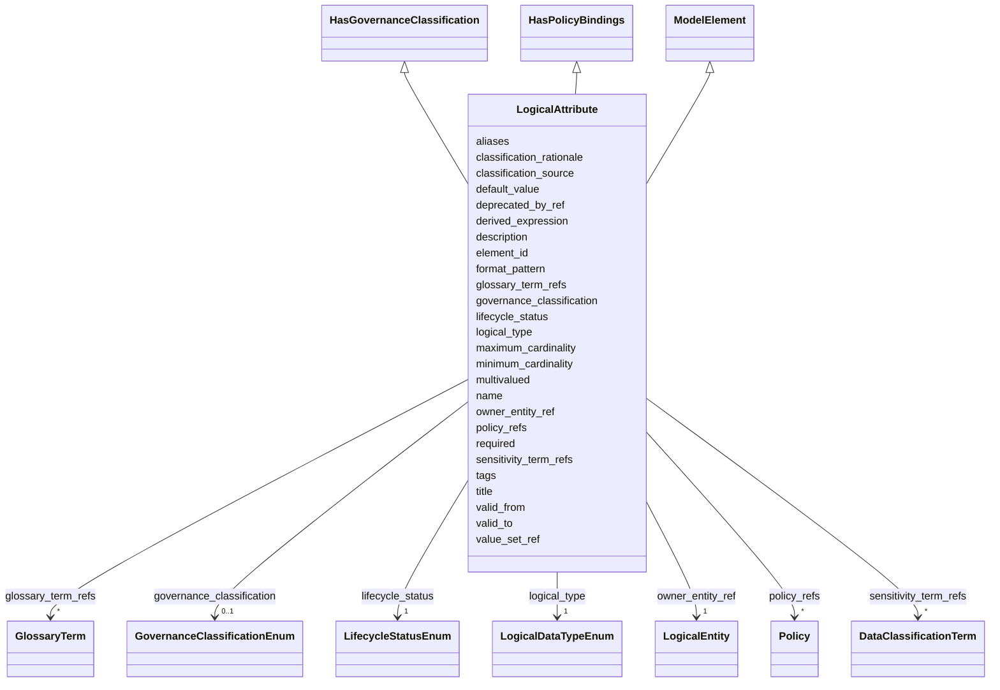

---
search:
  boost: 10.0
---

# Class: LogicalAttribute 


_Логический атрибут сущности с бизнес-смыслом, типом, обязательностью и классификацией._


<div data-search-exclude markdown="1">


URI: [dams:LogicalAttribute](https://data.moex.com/dams/LogicalAttribute)





## Inheritance
* [ModelElement](ModelElement.md) [ [HasLifecycle](HasLifecycle.md)]
    * **LogicalAttribute** [ [HasGovernanceClassification](HasGovernanceClassification.md) [HasPolicyBindings](HasPolicyBindings.md)]


## Slots

| Name | Cardinality and Range | Description | Inheritance |
| ---  | --- | --- | --- |
| [owner_entity_ref](owner_entity_ref.md) | 1 <br/> [LogicalEntity](LogicalEntity.md) |  | direct |
| [logical_type](logical_type.md) | 1 <br/> [LogicalDataTypeEnum](LogicalDataTypeEnum.md) |  | direct |
| [required](required.md) | 1 <br/> [Boolean](Boolean.md) |  | direct |
| [multivalued](multivalued.md) | 1 <br/> [Boolean](Boolean.md) |  | direct |
| [minimum_cardinality](minimum_cardinality.md) | 0..1 <br/> [Integer](Integer.md) |  | direct |
| [maximum_cardinality](maximum_cardinality.md) | 0..1 <br/> [Integer](Integer.md) |  | direct |
| [value_set_ref](value_set_ref.md) | 0..1 <br/> [Uri](Uri.md) |  | direct |
| [format_pattern](format_pattern.md) | 0..1 <br/> [String](String.md) |  | direct |
| [default_value](default_value.md) | 0..1 <br/> [String](String.md) |  | direct |
| [derived_expression](derived_expression.md) | 0..1 <br/> [String](String.md) |  | direct |
| [governance_classification](governance_classification.md) | 0..1 <br/> [GovernanceClassificationEnum](GovernanceClassificationEnum.md) |  | [HasGovernanceClassification](HasGovernanceClassification.md) |
| [sensitivity_term_refs](sensitivity_term_refs.md) | * <br/> [DataClassificationTerm](DataClassificationTerm.md) |  | [HasGovernanceClassification](HasGovernanceClassification.md) |
| [classification_source](classification_source.md) | 0..1 <br/> [String](String.md) |  | [HasGovernanceClassification](HasGovernanceClassification.md) |
| [classification_rationale](classification_rationale.md) | 0..1 <br/> [String](String.md) |  | [HasGovernanceClassification](HasGovernanceClassification.md) |
| [policy_refs](policy_refs.md) | * <br/> [Policy](Policy.md) |  | [HasPolicyBindings](HasPolicyBindings.md) |
| [element_id](element_id.md) | 1 <br/> [Uriorcurie](Uriorcurie.md) |  | [ModelElement](ModelElement.md) |
| [name](name.md) | 1 <br/> [String](String.md) |  | [ModelElement](ModelElement.md) |
| [title](title.md) | 0..1 <br/> [String](String.md) |  | [ModelElement](ModelElement.md) |
| [description](description.md) | 1 <br/> [String](String.md) |  | [ModelElement](ModelElement.md) |
| [aliases](aliases.md) | * <br/> [String](String.md) |  | [ModelElement](ModelElement.md) |
| [glossary_term_refs](glossary_term_refs.md) | * <br/> [GlossaryTerm](GlossaryTerm.md) |  | [ModelElement](ModelElement.md) |
| [tags](tags.md) | * <br/> [String](String.md) |  | [ModelElement](ModelElement.md) |
| [lifecycle_status](lifecycle_status.md) | 1 <br/> [LifecycleStatusEnum](LifecycleStatusEnum.md) |  | [HasLifecycle](HasLifecycle.md) |
| [valid_from](valid_from.md) | 0..1 <br/> [Datetime](Datetime.md) |  | [HasLifecycle](HasLifecycle.md) |
| [valid_to](valid_to.md) | 0..1 <br/> [Datetime](Datetime.md) |  | [HasLifecycle](HasLifecycle.md) |
| [deprecated_by_ref](deprecated_by_ref.md) | 0..1 <br/> [Uriorcurie](Uriorcurie.md) |  | [HasLifecycle](HasLifecycle.md) |


## Usages

| used by | used in | type | used |
| ---  | --- | --- | --- |
| [LogicalEntity](LogicalEntity.md) | [attributes](attributes.md) | range | [LogicalAttribute](LogicalAttribute.md) |
| [DataFlowEntityBinding](DataFlowEntityBinding.md) | [logical_attribute_refs](logical_attribute_refs.md) | range | [LogicalAttribute](LogicalAttribute.md) |
| [SelectedAttribute](SelectedAttribute.md) | [logical_attribute_ref](logical_attribute_ref.md) | range | [LogicalAttribute](LogicalAttribute.md) |
| [Metric](Metric.md) | [dimension_attribute_refs](dimension_attribute_refs.md) | range | [LogicalAttribute](LogicalAttribute.md) |
| [Metric](Metric.md) | [measure_attribute_refs](measure_attribute_refs.md) | range | [LogicalAttribute](LogicalAttribute.md) |
| [Dimension](Dimension.md) | [dimension_attribute_refs](dimension_attribute_refs.md) | range | [LogicalAttribute](LogicalAttribute.md) |


## Identifier and Mapping Information


### Schema Source


* from schema: https://data.moex.com/dams/v0.1


## Mappings

| Mapping Type | Mapped Value |
| ---  | ---  |
| self | dams:LogicalAttribute |
| native | dams:LogicalAttribute |


## LinkML Source

<!-- TODO: investigate https://stackoverflow.com/questions/37606292/how-to-create-tabbed-code-blocks-in-mkdocs-or-sphinx -->

### Direct

<details>
```yaml
name: LogicalAttribute
description: Логический атрибут сущности с бизнес-смыслом, типом, обязательностью
  и классификацией.
from_schema: https://data.moex.com/dams/v0.1
rank: 1000
is_a: ModelElement
mixins:
- HasGovernanceClassification
- HasPolicyBindings
slots:
- owner_entity_ref
- logical_type
- required
- multivalued
- minimum_cardinality
- maximum_cardinality
- value_set_ref
- format_pattern
- default_value
- derived_expression

```
</details>

### Induced

<details>
```yaml
name: LogicalAttribute
description: Логический атрибут сущности с бизнес-смыслом, типом, обязательностью
  и классификацией.
from_schema: https://data.moex.com/dams/v0.1
rank: 1000
is_a: ModelElement
mixins:
- HasGovernanceClassification
- HasPolicyBindings
attributes:
  owner_entity_ref:
    name: owner_entity_ref
    from_schema: https://data.moex.com/dams/v0.1
    rank: 1000
    owner: LogicalAttribute
    domain_of:
    - LogicalAttribute
    range: LogicalEntity
    required: true
    inlined: false
  logical_type:
    name: logical_type
    from_schema: https://data.moex.com/dams/v0.1
    rank: 1000
    owner: LogicalAttribute
    domain_of:
    - LogicalAttribute
    range: LogicalDataTypeEnum
    required: true
  required:
    name: required
    from_schema: https://data.moex.com/dams/v0.1
    rank: 1000
    owner: LogicalAttribute
    domain_of:
    - LogicalAttribute
    - PhysicalField
    range: boolean
    required: true
  multivalued:
    name: multivalued
    from_schema: https://data.moex.com/dams/v0.1
    rank: 1000
    owner: LogicalAttribute
    domain_of:
    - LogicalAttribute
    range: boolean
    required: true
  minimum_cardinality:
    name: minimum_cardinality
    from_schema: https://data.moex.com/dams/v0.1
    rank: 1000
    owner: LogicalAttribute
    domain_of:
    - LogicalAttribute
    range: integer
    minimum_value: 0
  maximum_cardinality:
    name: maximum_cardinality
    from_schema: https://data.moex.com/dams/v0.1
    rank: 1000
    owner: LogicalAttribute
    domain_of:
    - LogicalAttribute
    range: integer
    minimum_value: 1
  value_set_ref:
    name: value_set_ref
    from_schema: https://data.moex.com/dams/v0.1
    rank: 1000
    owner: LogicalAttribute
    domain_of:
    - LogicalAttribute
    range: uri
  format_pattern:
    name: format_pattern
    from_schema: https://data.moex.com/dams/v0.1
    rank: 1000
    owner: LogicalAttribute
    domain_of:
    - LogicalAttribute
    range: string
  default_value:
    name: default_value
    from_schema: https://data.moex.com/dams/v0.1
    rank: 1000
    owner: LogicalAttribute
    domain_of:
    - LogicalAttribute
    range: string
  derived_expression:
    name: derived_expression
    from_schema: https://data.moex.com/dams/v0.1
    rank: 1000
    owner: LogicalAttribute
    domain_of:
    - LogicalAttribute
    range: string
  governance_classification:
    name: governance_classification
    from_schema: https://data.moex.com/dams/v0.1
    rank: 1000
    owner: LogicalAttribute
    domain_of:
    - ClassificationAssignment
    - HasGovernanceClassification
    range: GovernanceClassificationEnum
  sensitivity_term_refs:
    name: sensitivity_term_refs
    from_schema: https://data.moex.com/dams/v0.1
    rank: 1000
    owner: LogicalAttribute
    domain_of:
    - HasGovernanceClassification
    range: DataClassificationTerm
    multivalued: true
    inlined: false
  classification_source:
    name: classification_source
    from_schema: https://data.moex.com/dams/v0.1
    rank: 1000
    owner: LogicalAttribute
    domain_of:
    - ClassificationAssignment
    - HasGovernanceClassification
    range: string
  classification_rationale:
    name: classification_rationale
    from_schema: https://data.moex.com/dams/v0.1
    rank: 1000
    owner: LogicalAttribute
    domain_of:
    - ClassificationAssignment
    - HasGovernanceClassification
    range: string
  policy_refs:
    name: policy_refs
    from_schema: https://data.moex.com/dams/v0.1
    rank: 1000
    owner: LogicalAttribute
    domain_of:
    - HasPolicyBindings
    range: Policy
    multivalued: true
    inlined: false
  element_id:
    name: element_id
    from_schema: https://data.moex.com/dams/v0.1
    rank: 1000
    identifier: true
    owner: LogicalAttribute
    domain_of:
    - ModelElement
    range: uriorcurie
    required: true
  name:
    name: name
    from_schema: https://data.moex.com/dams/v0.1
    rank: 1000
    owner: LogicalAttribute
    domain_of:
    - ModelElement
    - RequirementCatalog
    range: string
    required: true
  title:
    name: title
    from_schema: https://data.moex.com/dams/v0.1
    rank: 1000
    owner: LogicalAttribute
    domain_of:
    - ModelElement
    range: string
  description:
    name: description
    from_schema: https://data.moex.com/dams/v0.1
    rank: 1000
    owner: LogicalAttribute
    domain_of:
    - ModelElement
    range: string
    required: true
  aliases:
    name: aliases
    from_schema: https://data.moex.com/dams/v0.1
    rank: 1000
    owner: LogicalAttribute
    domain_of:
    - ModelElement
    range: string
    multivalued: true
  glossary_term_refs:
    name: glossary_term_refs
    from_schema: https://data.moex.com/dams/v0.1
    rank: 1000
    owner: LogicalAttribute
    domain_of:
    - ModelElement
    range: GlossaryTerm
    multivalued: true
    inlined: false
  tags:
    name: tags
    from_schema: https://data.moex.com/dams/v0.1
    rank: 1000
    owner: LogicalAttribute
    domain_of:
    - ModelElement
    range: string
    multivalued: true
  lifecycle_status:
    name: lifecycle_status
    from_schema: https://data.moex.com/dams/v0.1
    rank: 1000
    owner: LogicalAttribute
    domain_of:
    - HasLifecycle
    range: LifecycleStatusEnum
    required: true
  valid_from:
    name: valid_from
    from_schema: https://data.moex.com/dams/v0.1
    rank: 1000
    owner: LogicalAttribute
    domain_of:
    - ClassificationAssignment
    - PolicyBinding
    - HasLifecycle
    - Mapping
    range: datetime
  valid_to:
    name: valid_to
    from_schema: https://data.moex.com/dams/v0.1
    rank: 1000
    owner: LogicalAttribute
    domain_of:
    - ClassificationAssignment
    - PolicyBinding
    - HasLifecycle
    - Mapping
    range: datetime
  deprecated_by_ref:
    name: deprecated_by_ref
    from_schema: https://data.moex.com/dams/v0.1
    rank: 1000
    owner: LogicalAttribute
    domain_of:
    - HasLifecycle
    range: uriorcurie

```
</details></div>
