---
search:
  boost: 10.0
---

# Class: LogicalEntity 


_Представление бизнес-сущности в доменном контексте и модели конкретного решения._


<div data-search-exclude markdown="1">


URI: [dams:LogicalEntity](https://data.moex.com/dams/LogicalEntity)

```mermaid
 classDiagram
    class LogicalEntity
    click LogicalEntity href "../LogicalEntity/"
      HasOwnership <|-- LogicalEntity
        click HasOwnership href "../HasOwnership/"
      HasBusinessClassification <|-- LogicalEntity
        click HasBusinessClassification href "../HasBusinessClassification/"
      HasGovernanceClassification <|-- LogicalEntity
        click HasGovernanceClassification href "../HasGovernanceClassification/"
      HasPolicyBindings <|-- LogicalEntity
        click HasPolicyBindings href "../HasPolicyBindings/"
      ModelElement <|-- LogicalEntity
        click ModelElement href "../ModelElement/"
      
      LogicalEntity : aliases
        
      LogicalEntity : attributes
        
          
    
        
        
        LogicalEntity --> "*" LogicalAttribute : attributes
        click LogicalAttribute href "../LogicalAttribute/"
    

        
      LogicalEntity : business_importance
        
          
    
        
        
        LogicalEntity --> "0..1" BusinessImportanceEnum : business_importance
        click BusinessImportanceEnum href "../BusinessImportanceEnum/"
    

        
      LogicalEntity : classification_rationale
        
      LogicalEntity : classification_source
        
      LogicalEntity : conceptual_entity_refs
        
          
    
        
        
        LogicalEntity --> "*" ConceptualEntity : conceptual_entity_refs
        click ConceptualEntity href "../ConceptualEntity/"
    

        
      LogicalEntity : context_ref
        
          
    
        
        
        LogicalEntity --> "1" DomainContext : context_ref
        click DomainContext href "../DomainContext/"
    

        
      LogicalEntity : data_class
        
          
    
        
        
        LogicalEntity --> "0..1" DataClassEnum : data_class
        click DataClassEnum href "../DataClassEnum/"
    

        
      LogicalEntity : data_owner_ref
        
          
    
        
        
        LogicalEntity --> "0..1" Role : data_owner_ref
        click Role href "../Role/"
    

        
      LogicalEntity : data_steward_ref
        
          
    
        
        
        LogicalEntity --> "0..1" Role : data_steward_ref
        click Role href "../Role/"
    

        
      LogicalEntity : deprecated_by_ref
        
      LogicalEntity : description
        
      LogicalEntity : element_id
        
      LogicalEntity : entity_type
        
          
    
        
        
        LogicalEntity --> "0..1" EntityTypeEnum : entity_type
        click EntityTypeEnum href "../EntityTypeEnum/"
    

        
      LogicalEntity : glossary_term_refs
        
          
    
        
        
        LogicalEntity --> "*" GlossaryTerm : glossary_term_refs
        click GlossaryTerm href "../GlossaryTerm/"
    

        
      LogicalEntity : governance_classification
        
          
    
        
        
        LogicalEntity --> "0..1" GovernanceClassificationEnum : governance_classification
        click GovernanceClassificationEnum href "../GovernanceClassificationEnum/"
    

        
      LogicalEntity : invariant_refs
        
          
    
        
        
        LogicalEntity --> "*" Policy : invariant_refs
        click Policy href "../Policy/"
    

        
      LogicalEntity : key_attribute_refs
        
      LogicalEntity : lifecycle_status
        
          
    
        
        
        LogicalEntity --> "1" LifecycleStatusEnum : lifecycle_status
        click LifecycleStatusEnum href "../LifecycleStatusEnum/"
    

        
      LogicalEntity : name
        
      LogicalEntity : owning_unit_ref
        
          
    
        
        
        LogicalEntity --> "0..1" OrganizationUnit : owning_unit_ref
        click OrganizationUnit href "../OrganizationUnit/"
    

        
      LogicalEntity : policy_refs
        
          
    
        
        
        LogicalEntity --> "*" Policy : policy_refs
        click Policy href "../Policy/"
    

        
      LogicalEntity : sensitivity_term_refs
        
          
    
        
        
        LogicalEntity --> "*" DataClassificationTerm : sensitivity_term_refs
        click DataClassificationTerm href "../DataClassificationTerm/"
    

        
      LogicalEntity : solution_data_role
        
          
    
        
        
        LogicalEntity --> "1" SolutionDataRoleEnum : solution_data_role
        click SolutionDataRoleEnum href "../SolutionDataRoleEnum/"
    

        
      LogicalEntity : solution_ref
        
          
    
        
        
        LogicalEntity --> "0..1" ITSolution : solution_ref
        click ITSolution href "../ITSolution/"
    

        
      LogicalEntity : tags
        
      LogicalEntity : title
        
      LogicalEntity : valid_from
        
      LogicalEntity : valid_to
        
      
```





## Inheritance
* [ModelElement](ModelElement.md) [ [HasLifecycle](HasLifecycle.md)]
    * **LogicalEntity** [ [HasOwnership](HasOwnership.md) [HasBusinessClassification](HasBusinessClassification.md) [HasGovernanceClassification](HasGovernanceClassification.md) [HasPolicyBindings](HasPolicyBindings.md)]


## Slots

| Name | Cardinality and Range | Description | Inheritance |
| ---  | --- | --- | --- |
| [context_ref](context_ref.md) | 1 <br/> [DomainContext](DomainContext.md) |  | direct |
| [conceptual_entity_refs](conceptual_entity_refs.md) | * <br/> [ConceptualEntity](ConceptualEntity.md) |  | direct |
| [solution_ref](solution_ref.md) | 0..1 <br/> [ITSolution](ITSolution.md) |  | direct |
| [solution_data_role](solution_data_role.md) | 1 <br/> [SolutionDataRoleEnum](SolutionDataRoleEnum.md) |  | direct |
| [attributes](attributes.md) | * <br/> [LogicalAttribute](LogicalAttribute.md) |  | direct |
| [key_attribute_refs](key_attribute_refs.md) | * <br/> [Uriorcurie](Uriorcurie.md) |  | direct |
| [invariant_refs](invariant_refs.md) | * <br/> [Policy](Policy.md) |  | direct |
| [data_owner_ref](data_owner_ref.md) | 0..1 <br/> [Role](Role.md) |  | [HasOwnership](HasOwnership.md) |
| [data_steward_ref](data_steward_ref.md) | 0..1 <br/> [Role](Role.md) |  | [HasOwnership](HasOwnership.md) |
| [owning_unit_ref](owning_unit_ref.md) | 0..1 <br/> [OrganizationUnit](OrganizationUnit.md) |  | [HasOwnership](HasOwnership.md) |
| [entity_type](entity_type.md) | 0..1 <br/> [EntityTypeEnum](EntityTypeEnum.md) |  | [HasBusinessClassification](HasBusinessClassification.md) |
| [data_class](data_class.md) | 0..1 <br/> [DataClassEnum](DataClassEnum.md) |  | [HasBusinessClassification](HasBusinessClassification.md) |
| [business_importance](business_importance.md) | 0..1 <br/> [BusinessImportanceEnum](BusinessImportanceEnum.md) |  | [HasBusinessClassification](HasBusinessClassification.md) |
| [governance_classification](governance_classification.md) | 0..1 <br/> [GovernanceClassificationEnum](GovernanceClassificationEnum.md) |  | [HasGovernanceClassification](HasGovernanceClassification.md) |
| [sensitivity_term_refs](sensitivity_term_refs.md) | * <br/> [DataClassificationTerm](DataClassificationTerm.md) |  | [HasGovernanceClassification](HasGovernanceClassification.md) |
| [classification_source](classification_source.md) | 0..1 <br/> [String](String.md) |  | [HasGovernanceClassification](HasGovernanceClassification.md) |
| [classification_rationale](classification_rationale.md) | 0..1 <br/> [String](String.md) |  | [HasGovernanceClassification](HasGovernanceClassification.md) |
| [policy_refs](policy_refs.md) | * <br/> [Policy](Policy.md) |  | [HasPolicyBindings](HasPolicyBindings.md) |
| [element_id](element_id.md) | 1 <br/> [Uriorcurie](Uriorcurie.md) |  | [ModelElement](ModelElement.md) |
| [name](name.md) | 1 <br/> [String](String.md) |  | [ModelElement](ModelElement.md) |
| [title](title.md) | 0..1 <br/> [String](String.md) |  | [ModelElement](ModelElement.md) |
| [description](description.md) | 1 <br/> [String](String.md) |  | [ModelElement](ModelElement.md) |
| [aliases](aliases.md) | * <br/> [String](String.md) |  | [ModelElement](ModelElement.md) |
| [glossary_term_refs](glossary_term_refs.md) | * <br/> [GlossaryTerm](GlossaryTerm.md) |  | [ModelElement](ModelElement.md) |
| [tags](tags.md) | * <br/> [String](String.md) |  | [ModelElement](ModelElement.md) |
| [lifecycle_status](lifecycle_status.md) | 1 <br/> [LifecycleStatusEnum](LifecycleStatusEnum.md) |  | [HasLifecycle](HasLifecycle.md) |
| [valid_from](valid_from.md) | 0..1 <br/> [Datetime](Datetime.md) |  | [HasLifecycle](HasLifecycle.md) |
| [valid_to](valid_to.md) | 0..1 <br/> [Datetime](Datetime.md) |  | [HasLifecycle](HasLifecycle.md) |
| [deprecated_by_ref](deprecated_by_ref.md) | 0..1 <br/> [Uriorcurie](Uriorcurie.md) |  | [HasLifecycle](HasLifecycle.md) |


## Usages

| used by | used in | type | used |
| ---  | --- | --- | --- |
| [ModelPackage](ModelPackage.md) | [logical_entities](logical_entities.md) | range | [LogicalEntity](LogicalEntity.md) |
| [LogicalAttribute](LogicalAttribute.md) | [owner_entity_ref](owner_entity_ref.md) | range | [LogicalEntity](LogicalEntity.md) |
| [DataFlowEntityBinding](DataFlowEntityBinding.md) | [logical_entity_ref](logical_entity_ref.md) | range | [LogicalEntity](LogicalEntity.md) |
| [SelectedEntity](SelectedEntity.md) | [logical_entity_ref](logical_entity_ref.md) | range | [LogicalEntity](LogicalEntity.md) |
| [Metric](Metric.md) | [grain_entity_refs](grain_entity_refs.md) | range | [LogicalEntity](LogicalEntity.md) |
| [Dimension](Dimension.md) | [grain_entity_refs](grain_entity_refs.md) | range | [LogicalEntity](LogicalEntity.md) |


## Identifier and Mapping Information


### Schema Source


* from schema: https://data.moex.com/dams/v0.1


## Mappings

| Mapping Type | Mapped Value |
| ---  | ---  |
| self | dams:LogicalEntity |
| native | dams:LogicalEntity |


## LinkML Source

<!-- TODO: investigate https://stackoverflow.com/questions/37606292/how-to-create-tabbed-code-blocks-in-mkdocs-or-sphinx -->

### Direct

<details>
```yaml
name: LogicalEntity
description: Представление бизнес-сущности в доменном контексте и модели конкретного
  решения.
from_schema: https://data.moex.com/dams/v0.1
rank: 1000
is_a: ModelElement
mixins:
- HasOwnership
- HasBusinessClassification
- HasGovernanceClassification
- HasPolicyBindings
slots:
- context_ref
- conceptual_entity_refs
- solution_ref
- solution_data_role
- attributes
- key_attribute_refs
- invariant_refs

```
</details>

### Induced

<details>
```yaml
name: LogicalEntity
description: Представление бизнес-сущности в доменном контексте и модели конкретного
  решения.
from_schema: https://data.moex.com/dams/v0.1
rank: 1000
is_a: ModelElement
mixins:
- HasOwnership
- HasBusinessClassification
- HasGovernanceClassification
- HasPolicyBindings
attributes:
  context_ref:
    name: context_ref
    from_schema: https://data.moex.com/dams/v0.1
    rank: 1000
    owner: LogicalEntity
    domain_of:
    - LogicalEntity
    range: DomainContext
    required: true
    inlined: false
  conceptual_entity_refs:
    name: conceptual_entity_refs
    from_schema: https://data.moex.com/dams/v0.1
    rank: 1000
    owner: LogicalEntity
    domain_of:
    - LogicalEntity
    range: ConceptualEntity
    multivalued: true
    inlined: false
  solution_ref:
    name: solution_ref
    from_schema: https://data.moex.com/dams/v0.1
    rank: 1000
    owner: LogicalEntity
    domain_of:
    - ModelPackage
    - DomainContext
    - LogicalEntity
    - PhysicalObject
    range: ITSolution
    inlined: false
  solution_data_role:
    name: solution_data_role
    from_schema: https://data.moex.com/dams/v0.1
    rank: 1000
    owner: LogicalEntity
    domain_of:
    - LogicalEntity
    range: SolutionDataRoleEnum
    required: true
  attributes:
    name: attributes
    from_schema: https://data.moex.com/dams/v0.1
    rank: 1000
    owner: LogicalEntity
    domain_of:
    - LogicalEntity
    range: LogicalAttribute
    multivalued: true
    inlined: true
    inlined_as_list: true
  key_attribute_refs:
    name: key_attribute_refs
    from_schema: https://data.moex.com/dams/v0.1
    rank: 1000
    owner: LogicalEntity
    domain_of:
    - ConceptualEntity
    - LogicalEntity
    range: uriorcurie
    multivalued: true
  invariant_refs:
    name: invariant_refs
    from_schema: https://data.moex.com/dams/v0.1
    rank: 1000
    owner: LogicalEntity
    domain_of:
    - LogicalEntity
    range: Policy
    multivalued: true
    inlined: false
  data_owner_ref:
    name: data_owner_ref
    from_schema: https://data.moex.com/dams/v0.1
    rank: 1000
    owner: LogicalEntity
    domain_of:
    - HasOwnership
    range: Role
    inlined: false
  data_steward_ref:
    name: data_steward_ref
    from_schema: https://data.moex.com/dams/v0.1
    rank: 1000
    owner: LogicalEntity
    domain_of:
    - HasOwnership
    range: Role
    inlined: false
  owning_unit_ref:
    name: owning_unit_ref
    from_schema: https://data.moex.com/dams/v0.1
    rank: 1000
    owner: LogicalEntity
    domain_of:
    - HasOwnership
    range: OrganizationUnit
    inlined: false
  entity_type:
    name: entity_type
    from_schema: https://data.moex.com/dams/v0.1
    rank: 1000
    owner: LogicalEntity
    domain_of:
    - HasBusinessClassification
    range: EntityTypeEnum
  data_class:
    name: data_class
    from_schema: https://data.moex.com/dams/v0.1
    rank: 1000
    owner: LogicalEntity
    domain_of:
    - HasBusinessClassification
    range: DataClassEnum
  business_importance:
    name: business_importance
    from_schema: https://data.moex.com/dams/v0.1
    rank: 1000
    owner: LogicalEntity
    domain_of:
    - HasBusinessClassification
    range: BusinessImportanceEnum
  governance_classification:
    name: governance_classification
    from_schema: https://data.moex.com/dams/v0.1
    rank: 1000
    owner: LogicalEntity
    domain_of:
    - ClassificationAssignment
    - HasGovernanceClassification
    range: GovernanceClassificationEnum
  sensitivity_term_refs:
    name: sensitivity_term_refs
    from_schema: https://data.moex.com/dams/v0.1
    rank: 1000
    owner: LogicalEntity
    domain_of:
    - HasGovernanceClassification
    range: DataClassificationTerm
    multivalued: true
    inlined: false
  classification_source:
    name: classification_source
    from_schema: https://data.moex.com/dams/v0.1
    rank: 1000
    owner: LogicalEntity
    domain_of:
    - ClassificationAssignment
    - HasGovernanceClassification
    range: string
  classification_rationale:
    name: classification_rationale
    from_schema: https://data.moex.com/dams/v0.1
    rank: 1000
    owner: LogicalEntity
    domain_of:
    - ClassificationAssignment
    - HasGovernanceClassification
    range: string
  policy_refs:
    name: policy_refs
    from_schema: https://data.moex.com/dams/v0.1
    rank: 1000
    owner: LogicalEntity
    domain_of:
    - HasPolicyBindings
    range: Policy
    multivalued: true
    inlined: false
  element_id:
    name: element_id
    from_schema: https://data.moex.com/dams/v0.1
    rank: 1000
    identifier: true
    owner: LogicalEntity
    domain_of:
    - ModelElement
    range: uriorcurie
    required: true
  name:
    name: name
    from_schema: https://data.moex.com/dams/v0.1
    rank: 1000
    owner: LogicalEntity
    domain_of:
    - ModelElement
    - RequirementCatalog
    range: string
    required: true
  title:
    name: title
    from_schema: https://data.moex.com/dams/v0.1
    rank: 1000
    owner: LogicalEntity
    domain_of:
    - ModelElement
    range: string
  description:
    name: description
    from_schema: https://data.moex.com/dams/v0.1
    rank: 1000
    owner: LogicalEntity
    domain_of:
    - ModelElement
    range: string
    required: true
  aliases:
    name: aliases
    from_schema: https://data.moex.com/dams/v0.1
    rank: 1000
    owner: LogicalEntity
    domain_of:
    - ModelElement
    range: string
    multivalued: true
  glossary_term_refs:
    name: glossary_term_refs
    from_schema: https://data.moex.com/dams/v0.1
    rank: 1000
    owner: LogicalEntity
    domain_of:
    - ModelElement
    range: GlossaryTerm
    multivalued: true
    inlined: false
  tags:
    name: tags
    from_schema: https://data.moex.com/dams/v0.1
    rank: 1000
    owner: LogicalEntity
    domain_of:
    - ModelElement
    range: string
    multivalued: true
  lifecycle_status:
    name: lifecycle_status
    from_schema: https://data.moex.com/dams/v0.1
    rank: 1000
    owner: LogicalEntity
    domain_of:
    - HasLifecycle
    range: LifecycleStatusEnum
    required: true
  valid_from:
    name: valid_from
    from_schema: https://data.moex.com/dams/v0.1
    rank: 1000
    owner: LogicalEntity
    domain_of:
    - ClassificationAssignment
    - PolicyBinding
    - HasLifecycle
    - Mapping
    range: datetime
  valid_to:
    name: valid_to
    from_schema: https://data.moex.com/dams/v0.1
    rank: 1000
    owner: LogicalEntity
    domain_of:
    - ClassificationAssignment
    - PolicyBinding
    - HasLifecycle
    - Mapping
    range: datetime
  deprecated_by_ref:
    name: deprecated_by_ref
    from_schema: https://data.moex.com/dams/v0.1
    rank: 1000
    owner: LogicalEntity
    domain_of:
    - HasLifecycle
    range: uriorcurie

```
</details></div>
