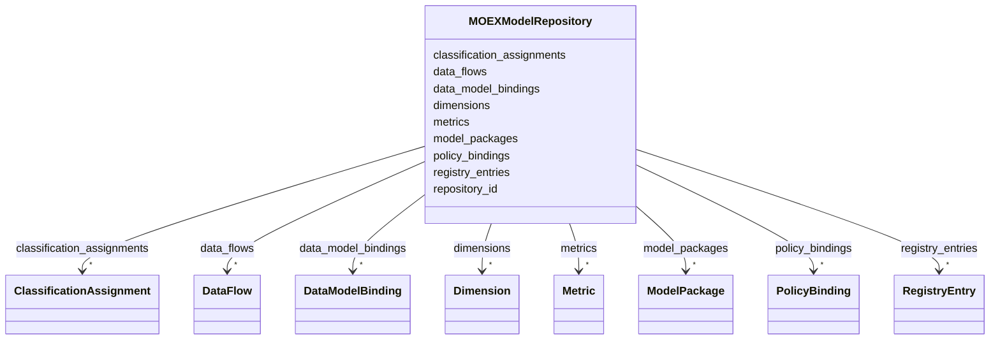

---
search:
  boost: 10.0
---

# Class: MOEXModelRepository 


_Корневой контейнер для проверки набора моделей, ссылочных проекций справочников, потоков и контрактных bindings._


<div data-search-exclude markdown="1">


URI: [dams:MOEXModelRepository](https://data.moex.com/dams/MOEXModelRepository)





<!-- no inheritance hierarchy -->

## Class Properties

| Property | Value |
| --- | --- |
| Tree Root | Yes |


## Slots

| Name | Cardinality and Range | Description | Inheritance |
| ---  | --- | --- | --- |
| [repository_id](repository_id.md) | 1 <br/> [Uriorcurie](Uriorcurie.md) |  | direct |
| [registry_entries](registry_entries.md) | * <br/> [RegistryEntry](RegistryEntry.md) |  | direct |
| [model_packages](model_packages.md) | * <br/> [ModelPackage](ModelPackage.md) |  | direct |
| [data_flows](data_flows.md) | * <br/> [DataFlow](DataFlow.md) |  | direct |
| [data_model_bindings](data_model_bindings.md) | * <br/> [DataModelBinding](DataModelBinding.md) |  | direct |
| [metrics](metrics.md) | * <br/> [Metric](Metric.md) |  | direct |
| [dimensions](dimensions.md) | * <br/> [Dimension](Dimension.md) |  | direct |
| [classification_assignments](classification_assignments.md) | * <br/> [ClassificationAssignment](ClassificationAssignment.md) |  | direct |
| [policy_bindings](policy_bindings.md) | * <br/> [PolicyBinding](PolicyBinding.md) |  | direct |


## Identifier and Mapping Information


### Schema Source


* from schema: https://data.moex.com/dams/v0.1


## Mappings

| Mapping Type | Mapped Value |
| ---  | ---  |
| self | dams:MOEXModelRepository |
| native | dams:MOEXModelRepository |


## LinkML Source

<!-- TODO: investigate https://stackoverflow.com/questions/37606292/how-to-create-tabbed-code-blocks-in-mkdocs-or-sphinx -->

### Direct

<details>
```yaml
name: MOEXModelRepository
description: Корневой контейнер для проверки набора моделей, ссылочных проекций справочников,
  потоков и контрактных bindings.
from_schema: https://data.moex.com/dams/v0.1
rank: 1000
slots:
- repository_id
- registry_entries
- model_packages
- data_flows
- data_model_bindings
- metrics
- dimensions
- classification_assignments
- policy_bindings
tree_root: true

```
</details>

### Induced

<details>
```yaml
name: MOEXModelRepository
description: Корневой контейнер для проверки набора моделей, ссылочных проекций справочников,
  потоков и контрактных bindings.
from_schema: https://data.moex.com/dams/v0.1
rank: 1000
attributes:
  repository_id:
    name: repository_id
    from_schema: https://data.moex.com/dams/v0.1
    rank: 1000
    identifier: true
    owner: MOEXModelRepository
    domain_of:
    - MOEXModelRepository
    range: uriorcurie
    required: true
  registry_entries:
    name: registry_entries
    from_schema: https://data.moex.com/dams/v0.1
    rank: 1000
    owner: MOEXModelRepository
    domain_of:
    - MOEXModelRepository
    range: RegistryEntry
    multivalued: true
    inlined: true
    inlined_as_list: true
  model_packages:
    name: model_packages
    from_schema: https://data.moex.com/dams/v0.1
    rank: 1000
    owner: MOEXModelRepository
    domain_of:
    - MOEXModelRepository
    range: ModelPackage
    multivalued: true
    inlined: true
    inlined_as_list: true
  data_flows:
    name: data_flows
    from_schema: https://data.moex.com/dams/v0.1
    rank: 1000
    owner: MOEXModelRepository
    domain_of:
    - MOEXModelRepository
    range: DataFlow
    multivalued: true
    inlined: true
    inlined_as_list: true
  data_model_bindings:
    name: data_model_bindings
    from_schema: https://data.moex.com/dams/v0.1
    rank: 1000
    owner: MOEXModelRepository
    domain_of:
    - MOEXModelRepository
    range: DataModelBinding
    multivalued: true
    inlined: true
    inlined_as_list: true
  metrics:
    name: metrics
    from_schema: https://data.moex.com/dams/v0.1
    rank: 1000
    owner: MOEXModelRepository
    domain_of:
    - MOEXModelRepository
    range: Metric
    multivalued: true
    inlined: true
    inlined_as_list: true
  dimensions:
    name: dimensions
    from_schema: https://data.moex.com/dams/v0.1
    rank: 1000
    owner: MOEXModelRepository
    domain_of:
    - MOEXModelRepository
    range: Dimension
    multivalued: true
    inlined: true
    inlined_as_list: true
  classification_assignments:
    name: classification_assignments
    from_schema: https://data.moex.com/dams/v0.1
    rank: 1000
    owner: MOEXModelRepository
    domain_of:
    - MOEXModelRepository
    range: ClassificationAssignment
    multivalued: true
    inlined: true
    inlined_as_list: true
  policy_bindings:
    name: policy_bindings
    from_schema: https://data.moex.com/dams/v0.1
    rank: 1000
    owner: MOEXModelRepository
    domain_of:
    - MOEXModelRepository
    range: PolicyBinding
    multivalued: true
    inlined: true
    inlined_as_list: true
tree_root: true

```
</details></div>
