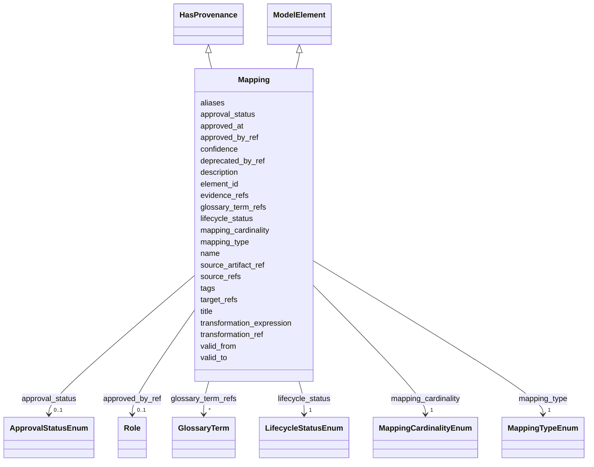

---
search:
  boost: 10.0
---

# Class: Mapping 


_Явное соответствие между элементами концептуального, логического и физического уровней._


<div data-search-exclude markdown="1">


URI: [dams:Mapping](https://data.moex.com/dams/Mapping)





## Inheritance
* [ModelElement](ModelElement.md) [ [HasLifecycle](HasLifecycle.md)]
    * **Mapping** [ [HasProvenance](HasProvenance.md)]


## Slots

| Name | Cardinality and Range | Description | Inheritance |
| ---  | --- | --- | --- |
| [source_refs](source_refs.md) | 1..* <br/> [Uriorcurie](Uriorcurie.md) |  | direct |
| [target_refs](target_refs.md) | 1..* <br/> [Uriorcurie](Uriorcurie.md) |  | direct |
| [mapping_type](mapping_type.md) | 1 <br/> [MappingTypeEnum](MappingTypeEnum.md) |  | direct |
| [mapping_cardinality](mapping_cardinality.md) | 1 <br/> [MappingCardinalityEnum](MappingCardinalityEnum.md) |  | direct |
| [transformation_ref](transformation_ref.md) | 0..1 <br/> [Uri](Uri.md) |  | direct |
| [transformation_expression](transformation_expression.md) | 0..1 <br/> [String](String.md) |  | direct |
| [confidence](confidence.md) | 0..1 <br/> [Decimal](Decimal.md) |  | direct |
| [valid_from](valid_from.md) | 0..1 <br/> [Datetime](Datetime.md) |  | direct |
| [valid_to](valid_to.md) | 0..1 <br/> [Datetime](Datetime.md) |  | direct |
| [source_artifact_ref](source_artifact_ref.md) | 0..1 <br/> [Uri](Uri.md) |  | [HasProvenance](HasProvenance.md) |
| [evidence_refs](evidence_refs.md) | * <br/> [Uri](Uri.md) |  | [HasProvenance](HasProvenance.md) |
| [approval_status](approval_status.md) | 0..1 <br/> [ApprovalStatusEnum](ApprovalStatusEnum.md) |  | [HasProvenance](HasProvenance.md) |
| [approved_by_ref](approved_by_ref.md) | 0..1 <br/> [Role](Role.md) |  | [HasProvenance](HasProvenance.md) |
| [approved_at](approved_at.md) | 0..1 <br/> [Datetime](Datetime.md) |  | [HasProvenance](HasProvenance.md) |
| [element_id](element_id.md) | 1 <br/> [Uriorcurie](Uriorcurie.md) |  | [ModelElement](ModelElement.md) |
| [name](name.md) | 1 <br/> [String](String.md) |  | [ModelElement](ModelElement.md) |
| [title](title.md) | 0..1 <br/> [String](String.md) |  | [ModelElement](ModelElement.md) |
| [description](description.md) | 1 <br/> [String](String.md) |  | [ModelElement](ModelElement.md) |
| [aliases](aliases.md) | * <br/> [String](String.md) |  | [ModelElement](ModelElement.md) |
| [glossary_term_refs](glossary_term_refs.md) | * <br/> [GlossaryTerm](GlossaryTerm.md) |  | [ModelElement](ModelElement.md) |
| [tags](tags.md) | * <br/> [String](String.md) |  | [ModelElement](ModelElement.md) |
| [lifecycle_status](lifecycle_status.md) | 1 <br/> [LifecycleStatusEnum](LifecycleStatusEnum.md) |  | [HasLifecycle](HasLifecycle.md) |
| [deprecated_by_ref](deprecated_by_ref.md) | 0..1 <br/> [Uriorcurie](Uriorcurie.md) |  | [HasLifecycle](HasLifecycle.md) |


## Usages

| used by | used in | type | used |
| ---  | --- | --- | --- |
| [ModelPackage](ModelPackage.md) | [mappings](mappings.md) | range | [Mapping](Mapping.md) |
| [DataFlowEntityBinding](DataFlowEntityBinding.md) | [transformation_mapping_refs](transformation_mapping_refs.md) | range | [Mapping](Mapping.md) |
| [SelectedAttribute](SelectedAttribute.md) | [transformation_mapping_ref](transformation_mapping_ref.md) | range | [Mapping](Mapping.md) |


## Identifier and Mapping Information


### Schema Source


* from schema: https://data.moex.com/dams/v0.1


## Mappings

| Mapping Type | Mapped Value |
| ---  | ---  |
| self | dams:Mapping |
| native | dams:Mapping |


## LinkML Source

<!-- TODO: investigate https://stackoverflow.com/questions/37606292/how-to-create-tabbed-code-blocks-in-mkdocs-or-sphinx -->

### Direct

<details>
```yaml
name: Mapping
description: Явное соответствие между элементами концептуального, логического и физического
  уровней.
from_schema: https://data.moex.com/dams/v0.1
rank: 1000
is_a: ModelElement
mixins:
- HasProvenance
slots:
- source_refs
- target_refs
- mapping_type
- mapping_cardinality
- transformation_ref
- transformation_expression
- confidence
- valid_from
- valid_to

```
</details>

### Induced

<details>
```yaml
name: Mapping
description: Явное соответствие между элементами концептуального, логического и физического
  уровней.
from_schema: https://data.moex.com/dams/v0.1
rank: 1000
is_a: ModelElement
mixins:
- HasProvenance
attributes:
  source_refs:
    name: source_refs
    from_schema: https://data.moex.com/dams/v0.1
    rank: 1000
    owner: Mapping
    domain_of:
    - Mapping
    range: uriorcurie
    multivalued: true
    minimum_cardinality: 1
  target_refs:
    name: target_refs
    from_schema: https://data.moex.com/dams/v0.1
    rank: 1000
    owner: Mapping
    domain_of:
    - Mapping
    range: uriorcurie
    multivalued: true
    minimum_cardinality: 1
  mapping_type:
    name: mapping_type
    from_schema: https://data.moex.com/dams/v0.1
    rank: 1000
    owner: Mapping
    domain_of:
    - Mapping
    range: MappingTypeEnum
    required: true
  mapping_cardinality:
    name: mapping_cardinality
    from_schema: https://data.moex.com/dams/v0.1
    rank: 1000
    owner: Mapping
    domain_of:
    - Mapping
    range: MappingCardinalityEnum
    required: true
  transformation_ref:
    name: transformation_ref
    from_schema: https://data.moex.com/dams/v0.1
    rank: 1000
    owner: Mapping
    domain_of:
    - Mapping
    range: uri
  transformation_expression:
    name: transformation_expression
    from_schema: https://data.moex.com/dams/v0.1
    rank: 1000
    owner: Mapping
    domain_of:
    - Mapping
    range: string
  confidence:
    name: confidence
    from_schema: https://data.moex.com/dams/v0.1
    rank: 1000
    owner: Mapping
    domain_of:
    - Mapping
    range: decimal
    minimum_value: 0
    maximum_value: 1
  valid_from:
    name: valid_from
    from_schema: https://data.moex.com/dams/v0.1
    rank: 1000
    owner: Mapping
    domain_of:
    - ClassificationAssignment
    - PolicyBinding
    - HasLifecycle
    - Mapping
    range: datetime
  valid_to:
    name: valid_to
    from_schema: https://data.moex.com/dams/v0.1
    rank: 1000
    owner: Mapping
    domain_of:
    - ClassificationAssignment
    - PolicyBinding
    - HasLifecycle
    - Mapping
    range: datetime
  source_artifact_ref:
    name: source_artifact_ref
    from_schema: https://data.moex.com/dams/v0.1
    rank: 1000
    owner: Mapping
    domain_of:
    - HasProvenance
    range: uri
  evidence_refs:
    name: evidence_refs
    from_schema: https://data.moex.com/dams/v0.1
    rank: 1000
    owner: Mapping
    domain_of:
    - HasProvenance
    range: uri
    multivalued: true
  approval_status:
    name: approval_status
    from_schema: https://data.moex.com/dams/v0.1
    rank: 1000
    owner: Mapping
    domain_of:
    - ClassificationAssignment
    - PolicyBinding
    - HasProvenance
    range: ApprovalStatusEnum
  approved_by_ref:
    name: approved_by_ref
    from_schema: https://data.moex.com/dams/v0.1
    rank: 1000
    owner: Mapping
    domain_of:
    - HasProvenance
    range: Role
    inlined: false
  approved_at:
    name: approved_at
    from_schema: https://data.moex.com/dams/v0.1
    rank: 1000
    owner: Mapping
    domain_of:
    - HasProvenance
    range: datetime
  element_id:
    name: element_id
    from_schema: https://data.moex.com/dams/v0.1
    rank: 1000
    identifier: true
    owner: Mapping
    domain_of:
    - ModelElement
    range: uriorcurie
    required: true
  name:
    name: name
    from_schema: https://data.moex.com/dams/v0.1
    rank: 1000
    owner: Mapping
    domain_of:
    - ModelElement
    - RequirementCatalog
    range: string
    required: true
  title:
    name: title
    from_schema: https://data.moex.com/dams/v0.1
    rank: 1000
    owner: Mapping
    domain_of:
    - ModelElement
    range: string
  description:
    name: description
    from_schema: https://data.moex.com/dams/v0.1
    rank: 1000
    owner: Mapping
    domain_of:
    - ModelElement
    range: string
    required: true
  aliases:
    name: aliases
    from_schema: https://data.moex.com/dams/v0.1
    rank: 1000
    owner: Mapping
    domain_of:
    - ModelElement
    range: string
    multivalued: true
  glossary_term_refs:
    name: glossary_term_refs
    from_schema: https://data.moex.com/dams/v0.1
    rank: 1000
    owner: Mapping
    domain_of:
    - ModelElement
    range: GlossaryTerm
    multivalued: true
    inlined: false
  tags:
    name: tags
    from_schema: https://data.moex.com/dams/v0.1
    rank: 1000
    owner: Mapping
    domain_of:
    - ModelElement
    range: string
    multivalued: true
  lifecycle_status:
    name: lifecycle_status
    from_schema: https://data.moex.com/dams/v0.1
    rank: 1000
    owner: Mapping
    domain_of:
    - HasLifecycle
    range: LifecycleStatusEnum
    required: true
  deprecated_by_ref:
    name: deprecated_by_ref
    from_schema: https://data.moex.com/dams/v0.1
    rank: 1000
    owner: Mapping
    domain_of:
    - HasLifecycle
    range: uriorcurie

```
</details></div>
