---
search:
  boost: 10.0
---

# Class: ModelElement 


_Абстрактный корень иерархии элементов модели: общая идентичность (element_id), имя, описание и жизненный цикл._


<div data-search-exclude markdown="1">


* __NOTE__: this is an abstract class and should not be instantiated directly


URI: [dams:ModelElement](https://data.moex.com/dams/ModelElement)

```mermaid
 classDiagram
    class ModelElement
    click ModelElement href "../ModelElement/"
      HasLifecycle <|-- ModelElement
        click HasLifecycle href "../HasLifecycle/"
      

      ModelElement <|-- ModelPackage
        click ModelPackage href "../ModelPackage/"
      ModelElement <|-- DomainContext
        click DomainContext href "../DomainContext/"
      ModelElement <|-- ConceptualEntity
        click ConceptualEntity href "../ConceptualEntity/"
      ModelElement <|-- LogicalEntity
        click LogicalEntity href "../LogicalEntity/"
      ModelElement <|-- LogicalAttribute
        click LogicalAttribute href "../LogicalAttribute/"
      ModelElement <|-- Relationship
        click Relationship href "../Relationship/"
      ModelElement <|-- PhysicalObject
        click PhysicalObject href "../PhysicalObject/"
      ModelElement <|-- PhysicalField
        click PhysicalField href "../PhysicalField/"
      ModelElement <|-- Mapping
        click Mapping href "../Mapping/"
      ModelElement <|-- DataFlow
        click DataFlow href "../DataFlow/"
      ModelElement <|-- DataFlowEntityBinding
        click DataFlowEntityBinding href "../DataFlowEntityBinding/"
      ModelElement <|-- DataModelBinding
        click DataModelBinding href "../DataModelBinding/"
      ModelElement <|-- ModelSelection
        click ModelSelection href "../ModelSelection/"
      ModelElement <|-- SelectedEntity
        click SelectedEntity href "../SelectedEntity/"
      ModelElement <|-- SelectedAttribute
        click SelectedAttribute href "../SelectedAttribute/"
      ModelElement <|-- Metric
        click Metric href "../Metric/"
      ModelElement <|-- Dimension
        click Dimension href "../Dimension/"
      ModelElement <|-- SpecificationRequirement
        click SpecificationRequirement href "../SpecificationRequirement/"
      

      ModelElement : aliases
        
      ModelElement : deprecated_by_ref
        
      ModelElement : description
        
      ModelElement : element_id
        
      ModelElement : glossary_term_refs
        
          
    
        
        
        ModelElement --> "*" GlossaryTerm : glossary_term_refs
        click GlossaryTerm href "../GlossaryTerm/"
    

        
      ModelElement : lifecycle_status
        
          
    
        
        
        ModelElement --> "1" LifecycleStatusEnum : lifecycle_status
        click LifecycleStatusEnum href "../LifecycleStatusEnum/"
    

        
      ModelElement : name
        
      ModelElement : tags
        
      ModelElement : title
        
      ModelElement : valid_from
        
      ModelElement : valid_to
        
      
```





## Inheritance
* **ModelElement** [ [HasLifecycle](HasLifecycle.md)]
    * [ModelPackage](ModelPackage.md) [ [HasOwnership](HasOwnership.md)]
    * [DomainContext](DomainContext.md) [ [HasOwnership](HasOwnership.md)]
    * [ConceptualEntity](ConceptualEntity.md) [ [HasOwnership](HasOwnership.md) [HasBusinessClassification](HasBusinessClassification.md)]
    * [LogicalEntity](LogicalEntity.md) [ [HasOwnership](HasOwnership.md) [HasBusinessClassification](HasBusinessClassification.md) [HasGovernanceClassification](HasGovernanceClassification.md) [HasPolicyBindings](HasPolicyBindings.md)]
    * [LogicalAttribute](LogicalAttribute.md) [ [HasGovernanceClassification](HasGovernanceClassification.md) [HasPolicyBindings](HasPolicyBindings.md)]
    * [Relationship](Relationship.md)
    * [PhysicalObject](PhysicalObject.md) [ [HasOwnership](HasOwnership.md) [HasPolicyBindings](HasPolicyBindings.md)]
    * [PhysicalField](PhysicalField.md)
    * [Mapping](Mapping.md) [ [HasProvenance](HasProvenance.md)]
    * [DataFlow](DataFlow.md) [ [HasOwnership](HasOwnership.md) [HasLifecycle](HasLifecycle.md)]
    * [DataFlowEntityBinding](DataFlowEntityBinding.md)
    * [DataModelBinding](DataModelBinding.md) [ [HasLifecycle](HasLifecycle.md) [HasOwnership](HasOwnership.md)]
    * [ModelSelection](ModelSelection.md)
    * [SelectedEntity](SelectedEntity.md)
    * [SelectedAttribute](SelectedAttribute.md)
    * [Metric](Metric.md) [ [HasOwnership](HasOwnership.md) [HasPolicyBindings](HasPolicyBindings.md)]
    * [Dimension](Dimension.md)
    * [SpecificationRequirement](SpecificationRequirement.md)


## Slots

| Name | Cardinality and Range | Description | Inheritance |
| ---  | --- | --- | --- |
| [element_id](element_id.md) | 1 <br/> [Uriorcurie](Uriorcurie.md) |  | direct |
| [name](name.md) | 1 <br/> [String](String.md) |  | direct |
| [title](title.md) | 0..1 <br/> [String](String.md) |  | direct |
| [description](description.md) | 1 <br/> [String](String.md) |  | direct |
| [aliases](aliases.md) | * <br/> [String](String.md) |  | direct |
| [glossary_term_refs](glossary_term_refs.md) | * <br/> [GlossaryTerm](GlossaryTerm.md) |  | direct |
| [tags](tags.md) | * <br/> [String](String.md) |  | direct |
| [lifecycle_status](lifecycle_status.md) | 1 <br/> [LifecycleStatusEnum](LifecycleStatusEnum.md) |  | [HasLifecycle](HasLifecycle.md) |
| [valid_from](valid_from.md) | 0..1 <br/> [Datetime](Datetime.md) |  | [HasLifecycle](HasLifecycle.md) |
| [valid_to](valid_to.md) | 0..1 <br/> [Datetime](Datetime.md) |  | [HasLifecycle](HasLifecycle.md) |
| [deprecated_by_ref](deprecated_by_ref.md) | 0..1 <br/> [Uriorcurie](Uriorcurie.md) |  | [HasLifecycle](HasLifecycle.md) |


## Identifier and Mapping Information


### Schema Source


* from schema: https://data.moex.com/dams/v0.1


## Mappings

| Mapping Type | Mapped Value |
| ---  | ---  |
| self | dams:ModelElement |
| native | dams:ModelElement |


## LinkML Source

<!-- TODO: investigate https://stackoverflow.com/questions/37606292/how-to-create-tabbed-code-blocks-in-mkdocs-or-sphinx -->

### Direct

<details>
```yaml
name: ModelElement
description: 'Абстрактный корень иерархии элементов модели: общая идентичность (element_id),
  имя, описание и жизненный цикл.'
from_schema: https://data.moex.com/dams/v0.1
rank: 1000
abstract: true
mixins:
- HasLifecycle
slots:
- element_id
- name
- title
- description
- aliases
- glossary_term_refs
- tags

```
</details>

### Induced

<details>
```yaml
name: ModelElement
description: 'Абстрактный корень иерархии элементов модели: общая идентичность (element_id),
  имя, описание и жизненный цикл.'
from_schema: https://data.moex.com/dams/v0.1
rank: 1000
abstract: true
mixins:
- HasLifecycle
attributes:
  element_id:
    name: element_id
    from_schema: https://data.moex.com/dams/v0.1
    rank: 1000
    identifier: true
    owner: ModelElement
    domain_of:
    - ModelElement
    range: uriorcurie
    required: true
  name:
    name: name
    from_schema: https://data.moex.com/dams/v0.1
    rank: 1000
    owner: ModelElement
    domain_of:
    - ModelElement
    - RequirementCatalog
    range: string
    required: true
  title:
    name: title
    from_schema: https://data.moex.com/dams/v0.1
    rank: 1000
    owner: ModelElement
    domain_of:
    - ModelElement
    range: string
  description:
    name: description
    from_schema: https://data.moex.com/dams/v0.1
    rank: 1000
    owner: ModelElement
    domain_of:
    - ModelElement
    range: string
    required: true
  aliases:
    name: aliases
    from_schema: https://data.moex.com/dams/v0.1
    rank: 1000
    owner: ModelElement
    domain_of:
    - ModelElement
    range: string
    multivalued: true
  glossary_term_refs:
    name: glossary_term_refs
    from_schema: https://data.moex.com/dams/v0.1
    rank: 1000
    owner: ModelElement
    domain_of:
    - ModelElement
    range: GlossaryTerm
    multivalued: true
    inlined: false
  tags:
    name: tags
    from_schema: https://data.moex.com/dams/v0.1
    rank: 1000
    owner: ModelElement
    domain_of:
    - ModelElement
    range: string
    multivalued: true
  lifecycle_status:
    name: lifecycle_status
    from_schema: https://data.moex.com/dams/v0.1
    rank: 1000
    owner: ModelElement
    domain_of:
    - HasLifecycle
    range: LifecycleStatusEnum
    required: true
  valid_from:
    name: valid_from
    from_schema: https://data.moex.com/dams/v0.1
    rank: 1000
    owner: ModelElement
    domain_of:
    - ClassificationAssignment
    - PolicyBinding
    - HasLifecycle
    - Mapping
    range: datetime
  valid_to:
    name: valid_to
    from_schema: https://data.moex.com/dams/v0.1
    rank: 1000
    owner: ModelElement
    domain_of:
    - ClassificationAssignment
    - PolicyBinding
    - HasLifecycle
    - Mapping
    range: datetime
  deprecated_by_ref:
    name: deprecated_by_ref
    from_schema: https://data.moex.com/dams/v0.1
    rank: 1000
    owner: ModelElement
    domain_of:
    - HasLifecycle
    range: uriorcurie

```
</details></div>
