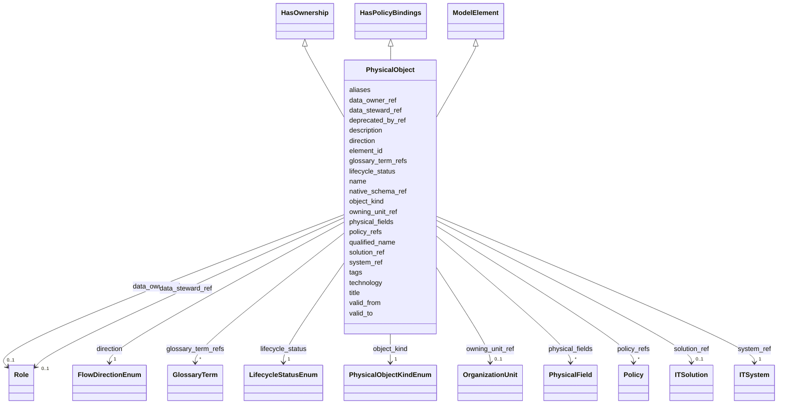

---
search:
  boost: 10.0
---

# Class: PhysicalObject 


_Квант данных или техническая точка публикации/потребления._


<div data-search-exclude markdown="1">


URI: [dams:PhysicalObject](https://data.moex.com/dams/PhysicalObject)





## Inheritance
* [ModelElement](ModelElement.md) [ [HasLifecycle](HasLifecycle.md)]
    * **PhysicalObject** [ [HasOwnership](HasOwnership.md) [HasPolicyBindings](HasPolicyBindings.md)]


## Slots

| Name | Cardinality and Range | Description | Inheritance |
| ---  | --- | --- | --- |
| [solution_ref](solution_ref.md) | 0..1 <br/> [ITSolution](ITSolution.md) |  | direct |
| [system_ref](system_ref.md) | 1 <br/> [ITSystem](ITSystem.md) |  | direct |
| [object_kind](object_kind.md) | 1 <br/> [PhysicalObjectKindEnum](PhysicalObjectKindEnum.md) |  | direct |
| [qualified_name](qualified_name.md) | 1 <br/> [String](String.md) |  | direct |
| [technology](technology.md) | 1 <br/> [String](String.md) |  | direct |
| [native_schema_ref](native_schema_ref.md) | 1 <br/> [Uri](Uri.md) |  | direct |
| [direction](direction.md) | 1 <br/> [FlowDirectionEnum](FlowDirectionEnum.md) |  | direct |
| [physical_fields](physical_fields.md) | * <br/> [PhysicalField](PhysicalField.md) |  | direct |
| [data_owner_ref](data_owner_ref.md) | 0..1 <br/> [Role](Role.md) |  | [HasOwnership](HasOwnership.md) |
| [data_steward_ref](data_steward_ref.md) | 0..1 <br/> [Role](Role.md) |  | [HasOwnership](HasOwnership.md) |
| [owning_unit_ref](owning_unit_ref.md) | 0..1 <br/> [OrganizationUnit](OrganizationUnit.md) |  | [HasOwnership](HasOwnership.md) |
| [policy_refs](policy_refs.md) | * <br/> [Policy](Policy.md) |  | [HasPolicyBindings](HasPolicyBindings.md) |
| [element_id](element_id.md) | 1 <br/> [Uriorcurie](Uriorcurie.md) |  | [ModelElement](ModelElement.md) |
| [name](name.md) | 1 <br/> [String](String.md) |  | [ModelElement](ModelElement.md) |
| [title](title.md) | 0..1 <br/> [String](String.md) |  | [ModelElement](ModelElement.md) |
| [description](description.md) | 1 <br/> [String](String.md) |  | [ModelElement](ModelElement.md) |
| [aliases](aliases.md) | * <br/> [String](String.md) |  | [ModelElement](ModelElement.md) |
| [glossary_term_refs](glossary_term_refs.md) | * <br/> [GlossaryTerm](GlossaryTerm.md) |  | [ModelElement](ModelElement.md) |
| [tags](tags.md) | * <br/> [String](String.md) |  | [ModelElement](ModelElement.md) |
| [lifecycle_status](lifecycle_status.md) | 1 <br/> [LifecycleStatusEnum](LifecycleStatusEnum.md) |  | [HasLifecycle](HasLifecycle.md) |
| [valid_from](valid_from.md) | 0..1 <br/> [Datetime](Datetime.md) |  | [HasLifecycle](HasLifecycle.md) |
| [valid_to](valid_to.md) | 0..1 <br/> [Datetime](Datetime.md) |  | [HasLifecycle](HasLifecycle.md) |
| [deprecated_by_ref](deprecated_by_ref.md) | 0..1 <br/> [Uriorcurie](Uriorcurie.md) |  | [HasLifecycle](HasLifecycle.md) |


## Usages

| used by | used in | type | used |
| ---  | --- | --- | --- |
| [ModelPackage](ModelPackage.md) | [physical_objects](physical_objects.md) | range | [PhysicalObject](PhysicalObject.md) |
| [PhysicalField](PhysicalField.md) | [physical_object_ref](physical_object_ref.md) | range | [PhysicalObject](PhysicalObject.md) |
| [DataFlowEntityBinding](DataFlowEntityBinding.md) | [physical_object_refs](physical_object_refs.md) | range | [PhysicalObject](PhysicalObject.md) |
| [SelectedEntity](SelectedEntity.md) | [physical_object_refs](physical_object_refs.md) | range | [PhysicalObject](PhysicalObject.md) |


## Identifier and Mapping Information


### Schema Source


* from schema: https://data.moex.com/dams/v0.1


## Mappings

| Mapping Type | Mapped Value |
| ---  | ---  |
| self | dams:PhysicalObject |
| native | dams:PhysicalObject |


## LinkML Source

<!-- TODO: investigate https://stackoverflow.com/questions/37606292/how-to-create-tabbed-code-blocks-in-mkdocs-or-sphinx -->

### Direct

<details>
```yaml
name: PhysicalObject
description: Квант данных или техническая точка публикации/потребления.
from_schema: https://data.moex.com/dams/v0.1
rank: 1000
is_a: ModelElement
mixins:
- HasOwnership
- HasPolicyBindings
slots:
- solution_ref
- system_ref
- object_kind
- qualified_name
- technology
- native_schema_ref
- direction
- physical_fields

```
</details>

### Induced

<details>
```yaml
name: PhysicalObject
description: Квант данных или техническая точка публикации/потребления.
from_schema: https://data.moex.com/dams/v0.1
rank: 1000
is_a: ModelElement
mixins:
- HasOwnership
- HasPolicyBindings
attributes:
  solution_ref:
    name: solution_ref
    from_schema: https://data.moex.com/dams/v0.1
    rank: 1000
    owner: PhysicalObject
    domain_of:
    - ModelPackage
    - DomainContext
    - LogicalEntity
    - PhysicalObject
    range: ITSolution
    inlined: false
  system_ref:
    name: system_ref
    from_schema: https://data.moex.com/dams/v0.1
    rank: 1000
    owner: PhysicalObject
    domain_of:
    - PhysicalObject
    range: ITSystem
    required: true
    inlined: false
  object_kind:
    name: object_kind
    from_schema: https://data.moex.com/dams/v0.1
    rank: 1000
    owner: PhysicalObject
    domain_of:
    - PhysicalObject
    range: PhysicalObjectKindEnum
    required: true
  qualified_name:
    name: qualified_name
    from_schema: https://data.moex.com/dams/v0.1
    rank: 1000
    owner: PhysicalObject
    domain_of:
    - PhysicalObject
    range: string
    required: true
  technology:
    name: technology
    from_schema: https://data.moex.com/dams/v0.1
    rank: 1000
    owner: PhysicalObject
    domain_of:
    - PhysicalObject
    range: string
    required: true
  native_schema_ref:
    name: native_schema_ref
    from_schema: https://data.moex.com/dams/v0.1
    rank: 1000
    owner: PhysicalObject
    domain_of:
    - PhysicalObject
    range: uri
    required: true
  direction:
    name: direction
    from_schema: https://data.moex.com/dams/v0.1
    rank: 1000
    owner: PhysicalObject
    domain_of:
    - PhysicalObject
    - DataFlowEntityBinding
    range: FlowDirectionEnum
    required: true
  physical_fields:
    name: physical_fields
    from_schema: https://data.moex.com/dams/v0.1
    rank: 1000
    owner: PhysicalObject
    domain_of:
    - PhysicalObject
    range: PhysicalField
    multivalued: true
    inlined: true
    inlined_as_list: true
  data_owner_ref:
    name: data_owner_ref
    from_schema: https://data.moex.com/dams/v0.1
    rank: 1000
    owner: PhysicalObject
    domain_of:
    - HasOwnership
    range: Role
    inlined: false
  data_steward_ref:
    name: data_steward_ref
    from_schema: https://data.moex.com/dams/v0.1
    rank: 1000
    owner: PhysicalObject
    domain_of:
    - HasOwnership
    range: Role
    inlined: false
  owning_unit_ref:
    name: owning_unit_ref
    from_schema: https://data.moex.com/dams/v0.1
    rank: 1000
    owner: PhysicalObject
    domain_of:
    - HasOwnership
    range: OrganizationUnit
    inlined: false
  policy_refs:
    name: policy_refs
    from_schema: https://data.moex.com/dams/v0.1
    rank: 1000
    owner: PhysicalObject
    domain_of:
    - HasPolicyBindings
    range: Policy
    multivalued: true
    inlined: false
  element_id:
    name: element_id
    from_schema: https://data.moex.com/dams/v0.1
    rank: 1000
    identifier: true
    owner: PhysicalObject
    domain_of:
    - ModelElement
    range: uriorcurie
    required: true
  name:
    name: name
    from_schema: https://data.moex.com/dams/v0.1
    rank: 1000
    owner: PhysicalObject
    domain_of:
    - ModelElement
    - RequirementCatalog
    range: string
    required: true
  title:
    name: title
    from_schema: https://data.moex.com/dams/v0.1
    rank: 1000
    owner: PhysicalObject
    domain_of:
    - ModelElement
    range: string
  description:
    name: description
    from_schema: https://data.moex.com/dams/v0.1
    rank: 1000
    owner: PhysicalObject
    domain_of:
    - ModelElement
    range: string
    required: true
  aliases:
    name: aliases
    from_schema: https://data.moex.com/dams/v0.1
    rank: 1000
    owner: PhysicalObject
    domain_of:
    - ModelElement
    range: string
    multivalued: true
  glossary_term_refs:
    name: glossary_term_refs
    from_schema: https://data.moex.com/dams/v0.1
    rank: 1000
    owner: PhysicalObject
    domain_of:
    - ModelElement
    range: GlossaryTerm
    multivalued: true
    inlined: false
  tags:
    name: tags
    from_schema: https://data.moex.com/dams/v0.1
    rank: 1000
    owner: PhysicalObject
    domain_of:
    - ModelElement
    range: string
    multivalued: true
  lifecycle_status:
    name: lifecycle_status
    from_schema: https://data.moex.com/dams/v0.1
    rank: 1000
    owner: PhysicalObject
    domain_of:
    - HasLifecycle
    range: LifecycleStatusEnum
    required: true
  valid_from:
    name: valid_from
    from_schema: https://data.moex.com/dams/v0.1
    rank: 1000
    owner: PhysicalObject
    domain_of:
    - ClassificationAssignment
    - PolicyBinding
    - HasLifecycle
    - Mapping
    range: datetime
  valid_to:
    name: valid_to
    from_schema: https://data.moex.com/dams/v0.1
    rank: 1000
    owner: PhysicalObject
    domain_of:
    - ClassificationAssignment
    - PolicyBinding
    - HasLifecycle
    - Mapping
    range: datetime
  deprecated_by_ref:
    name: deprecated_by_ref
    from_schema: https://data.moex.com/dams/v0.1
    rank: 1000
    owner: PhysicalObject
    domain_of:
    - HasLifecycle
    range: uriorcurie

```
</details></div>
