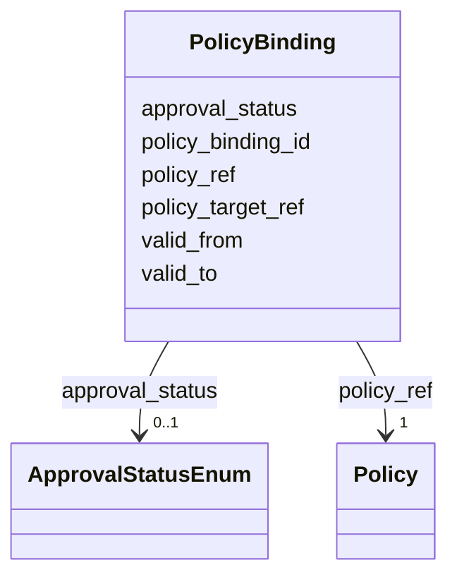

---
search:
  boost: 10.0
---

# Class: PolicyBinding 


_Применение управляемой политики к элементу модели._


<div data-search-exclude markdown="1">


URI: [dams:PolicyBinding](https://data.moex.com/dams/PolicyBinding)





<!-- no inheritance hierarchy -->

## Slots

| Name | Cardinality and Range | Description | Inheritance |
| ---  | --- | --- | --- |
| [policy_binding_id](policy_binding_id.md) | 1 <br/> [Uriorcurie](Uriorcurie.md) |  | direct |
| [policy_target_ref](policy_target_ref.md) | 1 <br/> [Uriorcurie](Uriorcurie.md) |  | direct |
| [policy_ref](policy_ref.md) | 1 <br/> [Policy](Policy.md) |  | direct |
| [valid_from](valid_from.md) | 0..1 <br/> [Datetime](Datetime.md) |  | direct |
| [valid_to](valid_to.md) | 0..1 <br/> [Datetime](Datetime.md) |  | direct |
| [approval_status](approval_status.md) | 0..1 <br/> [ApprovalStatusEnum](ApprovalStatusEnum.md) |  | direct |


## Usages

| used by | used in | type | used |
| ---  | --- | --- | --- |
| [MOEXModelRepository](MOEXModelRepository.md) | [policy_bindings](policy_bindings.md) | range | [PolicyBinding](PolicyBinding.md) |


## Identifier and Mapping Information


### Schema Source


* from schema: https://data.moex.com/dams/v0.1


## Mappings

| Mapping Type | Mapped Value |
| ---  | ---  |
| self | dams:PolicyBinding |
| native | dams:PolicyBinding |


## LinkML Source

<!-- TODO: investigate https://stackoverflow.com/questions/37606292/how-to-create-tabbed-code-blocks-in-mkdocs-or-sphinx -->

### Direct

<details>
```yaml
name: PolicyBinding
description: Применение управляемой политики к элементу модели.
from_schema: https://data.moex.com/dams/v0.1
rank: 1000
slots:
- policy_binding_id
- policy_target_ref
- policy_ref
- valid_from
- valid_to
- approval_status

```
</details>

### Induced

<details>
```yaml
name: PolicyBinding
description: Применение управляемой политики к элементу модели.
from_schema: https://data.moex.com/dams/v0.1
rank: 1000
attributes:
  policy_binding_id:
    name: policy_binding_id
    from_schema: https://data.moex.com/dams/v0.1
    rank: 1000
    identifier: true
    owner: PolicyBinding
    domain_of:
    - PolicyBinding
    range: uriorcurie
    required: true
  policy_target_ref:
    name: policy_target_ref
    from_schema: https://data.moex.com/dams/v0.1
    rank: 1000
    owner: PolicyBinding
    domain_of:
    - PolicyBinding
    range: uriorcurie
    required: true
  policy_ref:
    name: policy_ref
    from_schema: https://data.moex.com/dams/v0.1
    rank: 1000
    owner: PolicyBinding
    domain_of:
    - PolicyBinding
    range: Policy
    required: true
    inlined: false
  valid_from:
    name: valid_from
    from_schema: https://data.moex.com/dams/v0.1
    rank: 1000
    owner: PolicyBinding
    domain_of:
    - ClassificationAssignment
    - PolicyBinding
    - HasLifecycle
    - Mapping
    range: datetime
  valid_to:
    name: valid_to
    from_schema: https://data.moex.com/dams/v0.1
    rank: 1000
    owner: PolicyBinding
    domain_of:
    - ClassificationAssignment
    - PolicyBinding
    - HasLifecycle
    - Mapping
    range: datetime
  approval_status:
    name: approval_status
    from_schema: https://data.moex.com/dams/v0.1
    rank: 1000
    owner: PolicyBinding
    domain_of:
    - ClassificationAssignment
    - PolicyBinding
    - HasProvenance
    range: ApprovalStatusEnum

```
</details></div>
