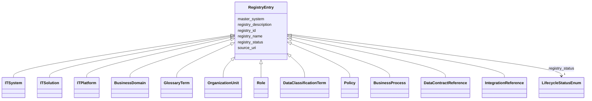

---
search:
  boost: 10.0
---

# Class: RegistryEntry 


_Локальная ссылочная проекция записи внешней мастер-системы; не является мастер-копией справочника._


<div data-search-exclude markdown="1">


* __NOTE__: this is an abstract class and should not be instantiated directly


URI: [dams:RegistryEntry](https://data.moex.com/dams/RegistryEntry)





## Inheritance
* **RegistryEntry**
    * [ITSystem](ITSystem.md)
    * [ITSolution](ITSolution.md)
    * [ITPlatform](ITPlatform.md)
    * [BusinessDomain](BusinessDomain.md)
    * [GlossaryTerm](GlossaryTerm.md)
    * [OrganizationUnit](OrganizationUnit.md)
    * [Role](Role.md)
    * [DataClassificationTerm](DataClassificationTerm.md)
    * [Policy](Policy.md)
    * [BusinessProcess](BusinessProcess.md)
    * [DataContractReference](DataContractReference.md)
    * [IntegrationReference](IntegrationReference.md)


## Slots

| Name | Cardinality and Range | Description | Inheritance |
| ---  | --- | --- | --- |
| [registry_id](registry_id.md) | 1 <br/> [Uriorcurie](Uriorcurie.md) |  | direct |
| [registry_name](registry_name.md) | 1 <br/> [String](String.md) |  | direct |
| [registry_description](registry_description.md) | 0..1 <br/> [String](String.md) |  | direct |
| [master_system](master_system.md) | 1 <br/> [String](String.md) |  | direct |
| [source_uri](source_uri.md) | 0..1 <br/> [Uri](Uri.md) |  | direct |
| [registry_status](registry_status.md) | 1 <br/> [LifecycleStatusEnum](LifecycleStatusEnum.md) |  | direct |


## Usages

| used by | used in | type | used |
| ---  | --- | --- | --- |
| [MOEXModelRepository](MOEXModelRepository.md) | [registry_entries](registry_entries.md) | range | [RegistryEntry](RegistryEntry.md) |


## Identifier and Mapping Information


### Schema Source


* from schema: https://data.moex.com/dams/v0.1


## Mappings

| Mapping Type | Mapped Value |
| ---  | ---  |
| self | dams:RegistryEntry |
| native | dams:RegistryEntry |


## LinkML Source

<!-- TODO: investigate https://stackoverflow.com/questions/37606292/how-to-create-tabbed-code-blocks-in-mkdocs-or-sphinx -->

### Direct

<details>
```yaml
name: RegistryEntry
description: Локальная ссылочная проекция записи внешней мастер-системы; не является
  мастер-копией справочника.
from_schema: https://data.moex.com/dams/v0.1
rank: 1000
abstract: true
slots:
- registry_id
- registry_name
- registry_description
- master_system
- source_uri
- registry_status

```
</details>

### Induced

<details>
```yaml
name: RegistryEntry
description: Локальная ссылочная проекция записи внешней мастер-системы; не является
  мастер-копией справочника.
from_schema: https://data.moex.com/dams/v0.1
rank: 1000
abstract: true
attributes:
  registry_id:
    name: registry_id
    from_schema: https://data.moex.com/dams/v0.1
    rank: 1000
    identifier: true
    owner: RegistryEntry
    domain_of:
    - RegistryEntry
    range: uriorcurie
    required: true
  registry_name:
    name: registry_name
    from_schema: https://data.moex.com/dams/v0.1
    rank: 1000
    owner: RegistryEntry
    domain_of:
    - RegistryEntry
    range: string
    required: true
  registry_description:
    name: registry_description
    from_schema: https://data.moex.com/dams/v0.1
    rank: 1000
    owner: RegistryEntry
    domain_of:
    - RegistryEntry
    range: string
  master_system:
    name: master_system
    from_schema: https://data.moex.com/dams/v0.1
    rank: 1000
    owner: RegistryEntry
    domain_of:
    - RegistryEntry
    range: string
    required: true
  source_uri:
    name: source_uri
    from_schema: https://data.moex.com/dams/v0.1
    rank: 1000
    owner: RegistryEntry
    domain_of:
    - RegistryEntry
    range: uri
  registry_status:
    name: registry_status
    from_schema: https://data.moex.com/dams/v0.1
    rank: 1000
    owner: RegistryEntry
    domain_of:
    - RegistryEntry
    range: LifecycleStatusEnum
    required: true

```
</details></div>
