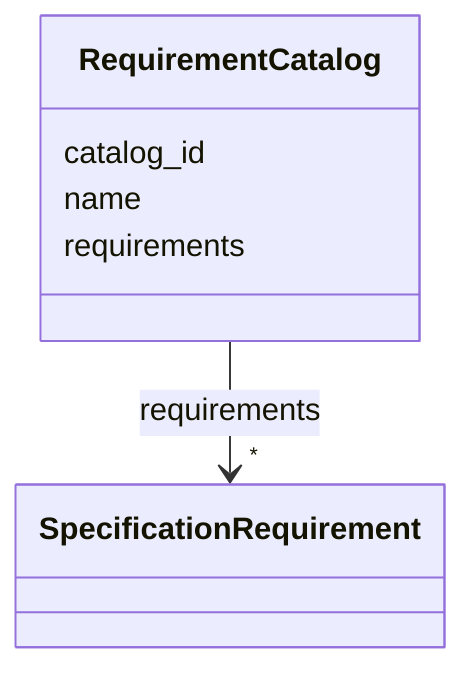

---
search:
  boost: 10.0
---

# Class: RequirementCatalog 


_Контейнер инстансов SpecificationRequirement вне ModelPackage._


<div data-search-exclude markdown="1">


URI: [dams:RequirementCatalog](https://data.moex.com/dams/RequirementCatalog)





<!-- no inheritance hierarchy -->

## Slots

| Name | Cardinality and Range | Description | Inheritance |
| ---  | --- | --- | --- |
| [catalog_id](catalog_id.md) | 1 <br/> [Uriorcurie](Uriorcurie.md) |  | direct |
| [name](name.md) | 1 <br/> [String](String.md) |  | direct |
| [requirements](requirements.md) | * <br/> [SpecificationRequirement](SpecificationRequirement.md) |  | direct |


## Identifier and Mapping Information


### Schema Source


* from schema: https://data.moex.com/dams/v0.1


## Mappings

| Mapping Type | Mapped Value |
| ---  | ---  |
| self | dams:RequirementCatalog |
| native | dams:RequirementCatalog |


## LinkML Source

<!-- TODO: investigate https://stackoverflow.com/questions/37606292/how-to-create-tabbed-code-blocks-in-mkdocs-or-sphinx -->

### Direct

<details>
```yaml
name: RequirementCatalog
description: Контейнер инстансов SpecificationRequirement вне ModelPackage.
from_schema: https://data.moex.com/dams/v0.1
rank: 1000
slots:
- catalog_id
- name
- requirements

```
</details>

### Induced

<details>
```yaml
name: RequirementCatalog
description: Контейнер инстансов SpecificationRequirement вне ModelPackage.
from_schema: https://data.moex.com/dams/v0.1
rank: 1000
attributes:
  catalog_id:
    name: catalog_id
    from_schema: https://data.moex.com/dams/v0.1
    rank: 1000
    identifier: true
    owner: RequirementCatalog
    domain_of:
    - RequirementCatalog
    range: uriorcurie
    required: true
  name:
    name: name
    from_schema: https://data.moex.com/dams/v0.1
    rank: 1000
    owner: RequirementCatalog
    domain_of:
    - ModelElement
    - RequirementCatalog
    range: string
    required: true
  requirements:
    name: requirements
    from_schema: https://data.moex.com/dams/v0.1
    rank: 1000
    owner: RequirementCatalog
    domain_of:
    - RequirementCatalog
    range: SpecificationRequirement
    multivalued: true
    inlined: true
    inlined_as_list: true

```
</details></div>
