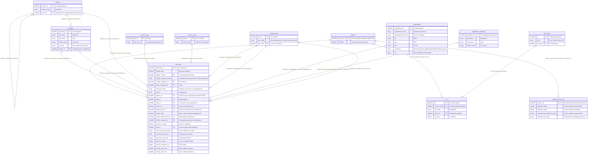

<!-- Generated by moex-dams-mermaid-er/0.1 profile=logical -->

```mermaid
erDiagram
    %% Generated by moex-dams-mermaid-er/0.1 profile=logical
    %% source package_id=dams:model/esed/0.1.0
    attorney_check_info {
        identifier instance_id PK,FK "ID экземпляра документа (карточки)"
        integer validation_status "Статус проверки полномочий"
        integer signature_status "Статус подписи документа"
        integer representative_signature_status "Статус подписи представителя"
        string validation_json_data "JSON-данные валидации (Контур)"
    }
    common_state {
        identifier state_id PK "ID состояния"
        string state_name "Название состояния"
    }
    common_type {
        identifier type_id PK "ID вида"
        string type_name "Название вида документа"
    }
    division {
        identifier division_id PK "ID подразделения"
        string division_name "Название"
        identifier parent_id FK "Родительское подразделение (иерархия)"
    }
    document {
        identifier document_id PK,FK "ID документа"
        datetime register_date "Дата регистрации"
        identifier register_number PK "Регистрационный номер"
        string register_external_number "Исходящий номер (внешний номер документа)"
        identifier register_employee_id FK "Регистратор"
        identifier author_employee_id FK "Автор"
        string document_name "Название (заголовок, тема документа)"
        string content "Содержание"
        identifier division_id FK "Ответственное подразделение (ЮЛ ГК МБ)"
        identifier type_id FK "Вид документа"
        identifier state_id FK "Состояние (статус) документа"
        identifier status_id FK "Статус (тип документа)"
        identifier delivery_type_id FK "ID типа доставки (способ получения)"
        datetime delivery_date "Дата от (дата получения документа)"
        identifier sender_organization_id FK "Организация-отправитель"
        identifier sender_employee_id FK "Сотрудник организации-отправителя"
        boolean answer_not_need "Ответ не требуется"
        identifier item_id FK "Строка справочника (рубрика)"
        string indoc_processing_status "Статус обработки в InDoc"
        string document_type_indoc "Тип документа в InDoc"
        integer document_type_kbd "Тип документа КБД"
        integer kbd_sync_status "Статус отправки в КБД"
        integer kbd_lku_document_id "ID ЛКУ КБД"
        datetime creation_date_time "Дата и время создания"
        datetime change_date_time "Дата и время изменения"
    }
    employee {
        identifier employee_id PK "ID сотрудника"
        string last_name "Фамилия"
        string first_name "Имя"
        string middle_name "Отчество"
        string ad_login "Пользователь (AD-логин)"
        identifier division_id FK "Подразделение сотрудника"
    }
    file {
        identifier id PK "ID записи файла"
        identifier owner_card_id FK "Карточка-владелец файла"
        string file_name "Имя файла"
        identifier binary_id FK "ID бинарных данных"
        integer file_type "Тип файла"
    }
    file_binary {
        identifier id PK "ID бинарных данных"
        string path "Путь к файлу (Nuxeo ID)"
        identifier storage_id PK "ID хранилища"
    }
    instance {
        identifier instance_id PK "ID экземпляра документа (карточки)"
        boolean deleted "Признак мягкого удаления"
    }
    organization {
        identifier organization_id PK "ID организации"
        string organization_name "Название (краткое)"
        string organization_full_name "Полное название"
        string inn "ИНН"
        string kpp "КПП"
        string ogrn "ОГРН"
        string comments "Дополнительная информация (MDM ID организации)"
        string fax "Факс (ICDB ID организации)"
    }
    organization_employee {
        identifier employee_id PK "ID сотрудника контрагента"
        string last_name "Фамилия"
        string first_name "Имя"
        string middle_name "Отчество"
    }
    universal_item {
        identifier item_id PK "ID значения"
        string item_name "Имя (наименование справочного значения)"
        identifier item_card PK "Ссылка на карточку"
    }
    instance |o--o{ attorney_check_info : "attorney_check_info_to_instance_via_instance_id"
    division |o--o{ division : "division_to_division_via_parent_id"
    instance |o--o{ document : "document_to_instance_via_document_id"
    employee |o--o{ document : "document_to_employee_via_register_employee_id"
    employee |o--o{ document : "document_to_employee_via_author_employee_id"
    division |o--o{ document : "document_to_division_via_division_id"
    common_type |o--o{ document : "document_to_common_type_via_type_id"
    common_state |o--o{ document : "document_to_common_state_via_state_id"
    universal_item |o--o{ document : "document_to_universal_item_via_status_id"
    universal_item |o--o{ document : "document_to_universal_item_via_delivery_type_id"
    organization |o--o{ document : "document_to_organization_via_sender_organization_id"
    organization_employee |o--o{ document : "document_to_organization_employee_via_sender_employee_id"
    universal_item |o--o{ document : "document_to_universal_item_via_item_id"
    division |o--o{ employee : "employee_to_division_via_division_id"
    instance |o--o{ file : "file_to_instance_via_owner_card_id"
    file_binary |o--o{ file : "file_to_file_binary_via_binary_id"
```
